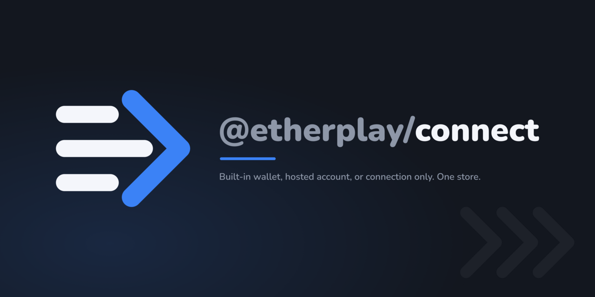

# Branding

The mark says the one thing this library does that its competitors cannot honestly claim: the owner of the account is a variable and the connection is not. Three unequal ways in (a connected wallet, a built-in wallet, a hosted account) feed one chevron, and only that chevron wears the accent, because the whole point is that whatever comes in, one connection comes out.



## Files

| File                                   | Authored or generated | Produced by                                                   |
| -------------------------------------- | --------------------- | ------------------------------------------------------------- |
| `logo.svg`                             | authored              | the mark, ink as `currentColor`, tight viewBox, no background |
| `icon.svg`                             | authored              | the _simplified_ mark on an opaque plate                      |
| `icon-maskable.svg`                    | authored              | full-bleed plate, mark inset to the safe circle               |
| `card.src.svg`                         | authored              | the card with LIVE TEXT: edit this one                        |
| `fonts/`                               | vendored              | Nunito Black + SemiBold, with `OFL.txt`                       |
| `card.svg`                             | generated             | `outline-text.py`, called by `build.sh`                       |
| `preview.png`                          | generated             | `build.sh` (1280x640)                                         |
| `icon.png`                             | generated             | `build.sh` (512x512)                                          |
| `web/favicon.ico`                      | generated             | `build.sh` (16, 32, 48 in one file)                           |
| `web/icon-192.png`, `web/icon-512.png` | generated             | `build.sh`                                                    |
| `web/apple-touch-icon.png`             | generated             | `build.sh` (180x180)                                          |
| `web/icon-maskable-512.png`            | generated             | `build.sh`                                                    |
| `concepts/`                            | working files         | kept on purpose; see "Dropped", below                         |

```sh
./build.sh          # regenerates everything; run it twice, the hashes match
python3 solve-card.py   # only after a copy or layout change: re-solves the card numbers
```

`solve-card.py` rewrites `card.src.svg` in place, so it is a deliberate step and not part of `build.sh`. `build.sh` never edits an authored file.

## Easy to undo by mistake

- **The chevron is the only accent.** Ink is `currentColor` so one file serves light and dark; only `#3b82f6` is fixed. Adding a second accent-coloured element removes the mark's focus, which is the thing that took four rounds to find.
- **The icon has two bars, the logo has three.** This is not an oversight and not drift. Three bars turn into a grey smear at 16px; two survive. `build.sh` therefore compares the bars _icon to maskable_ and the chevron _across every file_, and will fail if either drifts.
- **The icon's plate is opaque.** A transparent icon with dark ink vanishes on a dark browser tab. That is what the plate is for.
- **The maskable is scaled 0.81, not 0.88.** The usual 0.88 overflows the circular safe zone here, because this mark is wide (220x192) rather than square, and it is the _bar ends_ that break out at upper and lower left. 0.8291 is the exact boundary; 0.81 leaves 4.9px of clearance at 512. Re-verify after any geometry change by drawing the circle over the render and looking:
  ```sh
  magick web/icon-maskable-512.png -fill none -stroke red -strokewidth 4 \
    -draw "circle 256,256 256,51" /tmp/check.png
  ```
- **The card's texture chevrons sit wholly inside the 40px safe margin.** They were cropped by the canvas edge at first, which reads as an accident rather than as bleed.
- **The wordmark's font-size is fixed, not solved.** `solve-card.py` solves position and the tagline's size, but the wordmark's 71.117 is the size that was approved, and the width it happens to occupy is an _input_ to the centring. Solving it to a fixed width instead would silently shrink `connect` every time the copy grew, which is the opposite of why the short scoped name was chosen.

## The type

|                     | Value                                                                                       |
| ------------------- | ------------------------------------------------------------------------------------------- |
| Wordmark            | Nunito Black (900), `font-size: 71.117`, `@etherplay/` in `#8e97a8`, `connect` in `#f4f6fb` |
| Tagline             | Nunito SemiBold (600), `font-size: 20.114`, `#8e97a8`                                       |
| Accent rule         | 120x6, `rx 3`, `#3b82f6`, sharing the type's measured left edge                             |
| Ink / muted / plate | `#f4f6fb` / `#8e97a8` / `#13171f`                                                           |
| Accent              | `#3b82f6`                                                                                   |

Nunito was chosen by measurement, not by feel: the mark's stroke is a hard 14px when the mark is 96px tall beside a 56px cap height, and only Nunito 900, Outfit 800 and Poppins 700 hit that stem width. Nunito won among those three because its terminals are rounded, exactly like the mark's `stroke-linecap="round"`. Quicksand was the closest match on paper and was eliminated on measurement: it cannot reach 14px at any weight it ships.

To re-derive after a copy change: `python3 solve-card.py` then `./build.sh`. To re-check a _different_ face, measure the stem rather than trusting the family name, since a missing bold cut falls back silently:

```sh
python3 - <<'PY'
from PIL import Image, ImageDraw, ImageFont
def stem(path, cap=56):
    lo, hi, best = 4, 400, 12
    while lo <= hi:
        m = (lo+hi)//2; b = ImageFont.truetype(path, m).getbbox("E"); h = b[3]-b[1]
        if h < cap: best, lo = m, m+1
        elif h > cap: hi = m-1
        else: best = m; break
    f = ImageFont.truetype(path, best); b = f.getbbox("l")
    img = Image.new("L", (b[2]-b[0]+8, b[3]-b[1]+8), 0)
    ImageDraw.Draw(img).text((-b[0]+4, -b[1]+4), "l", font=f, fill=255)
    bb = img.getbbox()
    row = img.crop((0, (bb[1]+bb[3])//2, img.width, (bb[1]+bb[3])//2+1))
    return sum(1 for v in row.getdata() if v > 128)
print(stem("fonts/Nunito-Black.ttf"), "px stem; the mark's stroke is 14px")
PY
```

Licence: Nunito is OFL, so vendoring it and outlining it into `card.svg` are both permitted. `fonts/OFL.txt` is the upstream text.

## Dropped

Kept in `concepts/`, with `round1/` to `round4/` holding the rejected variants, so nobody re-proposes them cold.

- **Confluence** (three strands merging into one stem). Fused into a Cyrillic "Э" and, worse, into a plug prong. Redrawn with the gaps preserved, it became a flowchart: legible and meaningless.
- **The mount** (a constant holder, a swappable core). Round one was unmistakably a microphone. Round two, as a bracket pair, was the sharpest icon of the lot at 16px and the thinnest in meaning: a code bracket, saying nothing about connections or accounts.
- **The seed** (the mnemonic you can take with you). The best story and the worst icon. Round one was a flame, round two a rocket leaving a loading spinner. Two misreads from different causes is the signal to drop a metaphor rather than redraw it.
- **Equal bars.** Three equal bars beside a chevron is a hamburger menu next to a "next" button. Letting the bars' right ends follow the chevron's mouth is what fixed it, and it is why the middle bar is longer.
- **The pass-through** (one bar continuing past the chevron, for "you can leave with your keys"). Read as a dot stuck to the arrow, and vanished entirely below 32px.
- **Amber as the accent.** Rendered and rejected on contrast: `#f59e0b` on white loses noticeably more than `#3b82f6` at favicon size. It is the stronger of the two on dark, which did not outweigh a cost paid at every small size.
- **A two-weight wordmark** (`etherplay` light + `connect` black). Added a third weight to the staircase and went thin on dark, for a hierarchy the sibling mark already communicates.

## Known gaps

- **No short-form lockup.** Mark-plus-`connect` (without the scope) would serve avatars, docs chrome and slides, where the parent name is already on screen. Not built, because only the primary was agreed.
- **16px is soft.** The two-bar icon reads at 16 but the bars fuse toward grey. This is the accepted trade: three bars are unreadable there, two are merely soft.
- **`card.svg` differs from `card.src.svg` by 43 pixels**, all in glyph antialiasing, max delta 2/255. That is text-to-path rounding, not a design difference. The check that matters, `preview.png` reproducing from the outlined card with no font available at all, is exactly 0 differing pixels.
- **Only a dark card exists.** Add `preview-light.png` and a `<picture>` element in the README if a light one is ever wanted.
- **The card is not generated per package.** All seven packages share one image.
