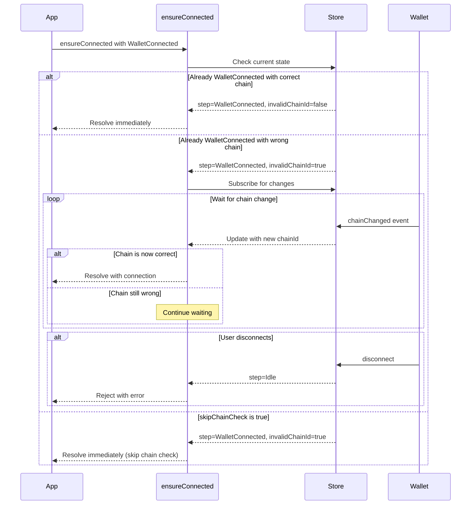

# ensureConnected Chain Validation Plan

## Quick Reference (TL;DR)

**File to modify:** [`packages/etherplay-connect/src/index.ts`](packages/etherplay-connect/src/index.ts)

**Changes needed:**
1. **Line 242-246:** Add `skipChainCheck?: boolean` to `ConnectionOptions` type
2. **Line 907-911:** Also add to the local `ConnectionOptions` type inside `createConnection`
3. **Lines 1202-1206:** Update type overload to allow `ConnectionOptions` as second arg
4. **Lines 1222-1237:** Fix argument parsing to detect if second arg is mechanism or options
5. **Lines 1244-1278:** Add `canResolve()` helper that checks both step AND chain validity

**Usage after implementation:**
```typescript
// Wait for correct chain (new default)
await connection.ensureConnected('WalletConnected');

// Skip chain check (opt-in for signature-only apps)
await connection.ensureConnected('WalletConnected', { skipChainCheck: true });
```

---

## Problem Statement

When calling `ensureConnected()` with target step `WalletConnected` (either via config or explicitly), it currently resolves immediately even if the wallet is connected to the wrong chain (`invalidChainId: true`).

**Current behavior:**
- `ensureConnected("WalletConnected")` resolves as soon as wallet is connected, regardless of chain
- Apps expecting to interact with the correct chain may fail

**Expected behavior:**
- `ensureConnected("WalletConnected")` should wait until the chain is correct before resolving
- An option `skipChainCheck` allows apps that only need signatures (chain-independent) to skip this validation

## Affected Code

### File: [`packages/etherplay-connect/src/index.ts`](packages/etherplay-connect/src/index.ts)

### Key Functions and Types:

1. **[`ConnectionOptions`](packages/etherplay-connect/src/index.ts:242)** - Type for connection options
2. **[`ensureConnected`](packages/etherplay-connect/src/index.ts:1199)** - Function to ensure connection state
3. **[`WalletState`](packages/etherplay-connect/src/index.ts:73)** - Contains `invalidChainId` property

## Implementation Plan

### 1. Update `ConnectionOptions` Type

**Location:** Line 242-246

**Current:**
```typescript
export type ConnectionOptions = {
    requireUserConfirmationBeforeSignatureRequest?: boolean;
    doNotStoreLocally?: boolean;
    requestSignatureRightAway?: boolean;
};
```

**New:**
```typescript
export type ConnectionOptions = {
    requireUserConfirmationBeforeSignatureRequest?: boolean;
    doNotStoreLocally?: boolean;
    requestSignatureRightAway?: boolean;
    skipChainCheck?: boolean;  // NEW: Skip chain validation for WalletConnected step
};
```

### 2. Create Helper Function for Chain Validation Check

Add a helper function to determine if we should wait for chain validation:

```typescript
function shouldWaitForChain(
    connection: Connection<WalletProviderType>,
    step: TargetStep,
    skipChainCheck?: boolean
): boolean {
    if (skipChainCheck) return false;
    if (step !== 'WalletConnected') return false;
    
    // Check if we have a wallet with invalid chain
    if (connection.step === 'WalletConnected' || 
        connection.step === 'SignedIn' && connection.wallet) {
        return connection.wallet?.invalidChainId === true;
    }
    return false;
}
```

### 3. Fix Argument Parsing in `ensureConnected`

**Location:** Lines 1222-1237

**Current (problematic):**
```typescript
if (typeof stepOrMechanismOrOptions === 'string') {
    // First arg is a step
    step = stepOrMechanismOrOptions as 'WalletConnected' | 'SignedIn';
    mechanism = mechanismOrOptions as Mechanism | undefined;  // Doesn't check if this is options!
    opts = options;
}
```

**New (with smart detection):**
```typescript
if (typeof stepOrMechanismOrOptions === 'string') {
    // First arg is a step
    step = stepOrMechanismOrOptions as 'WalletConnected' | 'SignedIn';
    // Check if second arg is a mechanism (has 'type') or options (doesn't have 'type')
    if (mechanismOrOptions && 'type' in (mechanismOrOptions as any)) {
        mechanism = mechanismOrOptions as Mechanism;
        opts = options;
    } else {
        mechanism = undefined;
        opts = mechanismOrOptions as ConnectionOptions | undefined;
    }
}
```

### 4. Update Type Overloads for `ensureConnected`

**Location:** Lines 1202-1211

**Current:**
```typescript
function ensureConnected(
    step: 'WalletConnected',
    mechanism?: WalletMechanism<string | undefined, `0x${string}` | undefined>,
    options?: ConnectionOptions,
): Promise<WalletConnected<WalletProviderType>>;
```

**New (allow options as second arg):**
```typescript
function ensureConnected(
    step: 'WalletConnected',
    mechanismOrOptions?: WalletMechanism<string | undefined, `0x${string}` | undefined> | ConnectionOptions,
    options?: ConnectionOptions,
): Promise<WalletConnected<WalletProviderType>>;
```

This allows both:
- `ensureConnected('WalletConnected', { skipChainCheck: true })` ✓
- `ensureConnected('WalletConnected', { type: 'wallet' }, { skipChainCheck: true })` ✓

### 5. Modify Promise Resolution Logic in `ensureConnected`

**Location:** Lines 1244-1278

**Current logic (problematic):**
```typescript
const promise = new Promise<...>((resolve, reject) => {
    // ...
    } else if ($connection.step == step) {
        resolve($connection as any);  // Resolves immediately without chain check
        return;
    }
    // ...
    const unsubscribe = _store.subscribe((connection) => {
        if (connection.step === 'Idle' && idlePassed) {
            unsubscribe();
            reject();
        }
        // ...
        if (connection.step === step) {
            unsubscribe();
            resolve(connection as any);  // Resolves without chain check
        }
    });
});
```

**New logic:**

```typescript
const promise = new Promise<...>((resolve, reject) => {
    let forceConnect = false;
    
    // Helper to check if resolution conditions are met
    const canResolve = (connection: Connection<WalletProviderType>): boolean => {
        // Must be at the target step
        if (connection.step !== step) return false;
        
        // For WalletConnected step, check chain validity unless skipped
        if (step === 'WalletConnected' && !opts?.skipChainCheck) {
            // connection.wallet should exist when step is WalletConnected
            if (connection.wallet?.invalidChainId) {
                return false;  // Wrong chain, wait for chain change
            }
        }
        
        return true;
    };

    if (
        $connection.step == 'WalletConnected' &&
        ($connection.wallet.status == 'locked' || $connection.wallet.status === 'disconnected')
    ) {
        forceConnect = true;
        mechanism = $connection.mechanism;
    } else if (canResolve($connection)) {
        // Only resolve if step matches AND chain is valid (or skipChainCheck)
        resolve($connection as any);
        return;
    }
    
    let idlePassed = $connection.step != 'Idle';
    if (!idlePassed || forceConnect) {
        connect(mechanism, opts);
    }
    
    const unsubscribe = _store.subscribe((connection) => {
        // Reject on disconnect/back to Idle
        if (connection.step === 'Idle' && idlePassed) {
            unsubscribe();
            reject(new Error('Connection cancelled'));
        }
        
        if (!idlePassed && connection.step !== 'Idle') {
            idlePassed = true;
        }
        
        // Check full resolution conditions including chain validity
        if (canResolve(connection)) {
            unsubscribe();
            resolve(connection as any);
        }
    });
});
```

### 6. Edge Cases to Handle

| Scenario | Expected Behavior |
|----------|-------------------|
| `ensureConnected('WalletConnected')` with correct chain | Resolve immediately |
| `ensureConnected('WalletConnected')` with wrong chain | Wait for chain switch, then resolve |
| `ensureConnected('WalletConnected', {skipChainCheck: true})` with wrong chain | Resolve immediately |
| `ensureConnected('WalletConnected', {type: 'wallet'}, {skipChainCheck: true})` with wrong chain | Resolve immediately |
| User disconnects while waiting for chain | Reject the promise |
| User calls `back()` while waiting for chain | Reject the promise (goes to Idle) |
| `ensureConnected('SignedIn')` with wrong chain | Resolve immediately (chain check only for WalletConnected) |
| Config has `targetStep: 'WalletConnected'`, user calls `ensureConnected()` with wrong chain | Wait for chain switch |
| Config has `targetStep: 'SignedIn'`, user calls `ensureConnected('WalletConnected')` with wrong chain | Wait for chain switch |

### 5. Type Updates for ensureConnected Overloads

The existing type overloads at lines 275-307 already pass `ConnectionOptions` correctly. No changes needed to the type signatures since `skipChainCheck` will be part of `ConnectionOptions`.

## Sequence Diagram



## Testing Considerations

1. **Unit Tests:**
   - Test `ensureConnected` resolves immediately when chain is correct
   - Test `ensureConnected` waits when chain is wrong
   - Test `ensureConnected` with `skipChainCheck: true` resolves despite wrong chain
   - Test rejection on disconnect
   - Test rejection on back to Idle

2. **Integration Tests:**
   - Test full flow with wallet connection and chain switching
   - Test with different `targetStep` configurations

3. **Manual Testing:**
   - Connect with wallet on wrong network, verify UI waits
   - Switch to correct network, verify resolution
   - Test disconnect during wait

## Migration Notes

This is a **breaking change** in behavior for apps that:
1. Use `ensureConnected('WalletConnected')` or have `targetStep: 'WalletConnected'`
2. Previously handled chain validation manually after resolution
3. Expect immediate resolution regardless of chain

**Mitigation:** Apps can add `skipChainCheck: true` to maintain previous behavior:
```typescript
// Previous behavior (now requires explicit opt-in)
await connection.ensureConnected('WalletConnected', { skipChainCheck: true });

// New default behavior (waits for correct chain)
await connection.ensureConnected('WalletConnected');
```

## Implementation Checklist

- [ ] Add `skipChainCheck?: boolean` to exported `ConnectionOptions` type (line ~245)
- [ ] Add `skipChainCheck?: boolean` to local `ConnectionOptions` type inside `createConnection` (line ~910)
- [ ] Update `ensureConnected` type overload for `'WalletConnected'` to accept `ConnectionOptions` as second arg (line ~1203)
- [ ] Fix argument parsing in `ensureConnected` to detect mechanism vs options (lines ~1222-1237)
- [ ] Add `canResolve()` helper function inside `ensureConnected`
- [ ] Update immediate resolution check to use `canResolve()` (line ~1253)
- [ ] Update subscription handler to use `canResolve()` (line ~1269)
- [ ] Test: `ensureConnected('WalletConnected')` waits when chain is wrong
- [ ] Test: `ensureConnected('WalletConnected', {skipChainCheck: true})` resolves immediately
- [ ] Test: Rejection on disconnect/back
