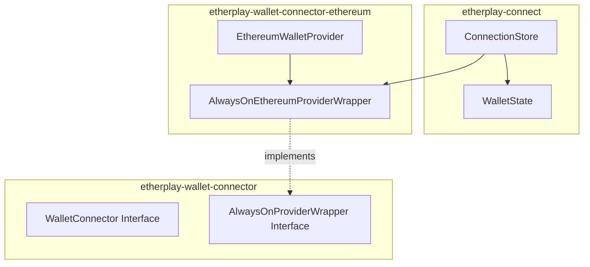
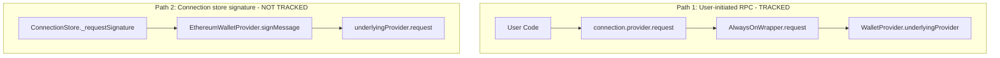

# RPC Request Tracking Implementation Plan

## Overview

This document details the implementation of RPC request tracking for the etherplay-connect ecosystem, enabling the UI to show modals when transactions or message signing requests are pending user approval in their wallet.

**Status**: Ready for implementation

---

## Decisions Made

After investigation and discussion, the following decisions were made:

### Approach: Hybrid (Option A + Option C)

1. **Integrate `pendingRequests` into `WalletState`** - Single subscription point for Svelte reactivity
2. **Also expose `onRequest` events** - For advanced use cases and non-Svelte consumers

### Scope

| Decision | Choice |
|----------|--------|
| Which methods to track | User-facing only: `eth_sendTransaction`, `personal_sign`, `eth_signTypedData`, `eth_signTypedData_v4`, `eth_sign`, `eth_signTransaction` |
| Exclude wallet methods | Yes - `wallet_switchEthereumChain`, `wallet_addEthereumChain` already have `switchingChain` state |
| Exclude `eth_requestAccounts` | Yes - internal to connection flow |
| Request metadata | No - just method name and type. Code should allow easy addition later. |
| Performance opt-in | No - not needed since update frequency is low (2 updates per user action) |
| `_requestSignature()` integration | Keep separate - it already works and has its own `WaitingForSignature` step |
| Path 2 (EthereumWalletProvider.signMessage) | Not tracked - internal to Connection store, handled by existing UI |

### Request Type Classification

```typescript
type PendingRequestKind = 'transaction' | 'signature';
```

- **`transaction`**: `eth_sendTransaction`
- **`signature`**: `personal_sign`, `eth_signTypedData`, `eth_signTypedData_v4`, `eth_sign`, `eth_signTransaction`

---

## Current Architecture Analysis

### Key Components



### Signing Paths

There are two paths where signing/transactions occur:



**Path 1** is tracked by this feature - these are user-initiated transactions/signatures.

**Path 2** is NOT tracked - this is internal to the Connection store for origin key signing and already has its own `WaitingForSignature` step in the connection state machine.

### AlwaysOnEthereumProviderWrapper

Located in [`packages/etherplay-wallet-connector-ethereum/src/provider.ts`](packages/etherplay-wallet-connector-ethereum/src/provider.ts:20), this class:

- Routes all RPC requests through a single `request()` method (line 38)
- Already identifies signing methods requiring user approval:
  ```typescript
  const signerMethods = ['eth_accounts', 'eth_sign', 'eth_signTransaction', 'personal_sign', 'eth_signTypedData_v4', 'eth_signTypedData'];
  const connectedAccountMethods = ['eth_sendTransaction'];
  const walletOnlyMethods = ['eth_requestAccounts', 'wallet_switchEthereumChain', 'wallet_addEthereumChain'];
  ```

### WalletState

Defined in [`packages/etherplay-connect/src/index.ts:74-81`](packages/etherplay-connect/src/index.ts:74), currently tracks:

```typescript
export type WalletState<WalletProviderType> = {
    provider: WalletProvider<WalletProviderType>;
    accounts: `0x${string}`[];
    accountChanged?: `0x${string}`;
    chainId: string;
    invalidChainId: boolean;
    switchingChain: 'addingChain' | 'switchingChain' | false;
} & ({status: 'connected'} | {status: 'locked'; unlocking: boolean} | {status: 'disconnected'; connecting: boolean});
```

### Connection Store

Uses Svelte's `writable` store (line 471) for reactive state management.

---

## Implementation Details

### New Types

#### File: `packages/etherplay-wallet-connector/src/index.ts`

Add these types:

```typescript
// Methods that require user approval and should be tracked
export const TRACKED_REQUEST_METHODS = [
    'eth_sendTransaction',
    'personal_sign',
    'eth_signTypedData',
    'eth_signTypedData_v4',
    'eth_sign',
    'eth_signTransaction',
] as const;

export type TrackedRequestMethod = typeof TRACKED_REQUEST_METHODS[number];

export type PendingRequestKind = 'transaction' | 'signature';

export interface PendingRequest {
    id: string;                    // Unique request ID (use crypto.randomUUID or counter)
    method: TrackedRequestMethod;  // The RPC method being called
    kind: PendingRequestKind;      // High-level classification
    startedAt: number;             // Date.now() timestamp
}

export type RequestEventType = 'requestStart' | 'requestEnd';

export type RequestResult = 'success' | 'error' | 'rejected';

export interface RequestEvent {
    type: RequestEventType;
    request: PendingRequest;
    result?: RequestResult;        // Only present on 'requestEnd'
    error?: unknown;               // Only present on 'requestEnd' with 'error' result
}

export type RequestEventHandler = (event: RequestEvent) => void;
```

#### Extended AlwaysOnProviderWrapper Interface

```typescript
export interface AlwaysOnProviderWrapper<WalletProviderType> {
    // Existing
    setWalletProvider: (walletProvider: WalletProviderType | undefined) => void;
    setWalletStatus: (newStatus: 'connected' | 'locked' | 'disconnected') => void;
    chainId: string;
    provider: WalletProviderType;
    
    // New - Event subscription
    onRequest: (handler: RequestEventHandler) => () => void;  // Returns unsubscribe function
    
    // New - Current state accessor (for initial state on subscription)
    getPendingRequests: () => PendingRequest[];
}
```

### Implementation in AlwaysOnEthereumProviderWrapper

#### File: `packages/etherplay-wallet-connector-ethereum/src/provider.ts`

```typescript
import type { 
    AlwaysOnProviderWrapper, 
    PendingRequest, 
    RequestEvent, 
    RequestEventHandler,
    TrackedRequestMethod,
    TRACKED_REQUEST_METHODS,
    PendingRequestKind
} from '@etherplay/wallet-connector';

// Helper to determine request kind
function getRequestKind(method: TrackedRequestMethod): PendingRequestKind {
    return method === 'eth_sendTransaction' ? 'transaction' : 'signature';
}

// Helper to check if method should be tracked
function isTrackedMethod(method: string): method is TrackedRequestMethod {
    return TRACKED_REQUEST_METHODS.includes(method as TrackedRequestMethod);
}

class AlwaysOnEthereumProviderWrapper implements AlwaysOnProviderWrapper<CurriedRPC<Methods>> {
    // ... existing fields ...
    
    // New fields for request tracking
    private pendingRequests: Map<string, PendingRequest> = new Map();
    private requestHandlers: Set<RequestEventHandler> = new Set();
    private requestCounter = 0;

    // ... existing constructor ...

    // New: Event subscription
    onRequest(handler: RequestEventHandler): () => void {
        this.requestHandlers.add(handler);
        return () => {
            this.requestHandlers.delete(handler);
        };
    }

    // New: Get current pending requests
    getPendingRequests(): PendingRequest[] {
        return Array.from(this.pendingRequests.values());
    }

    // New: Emit event to all handlers
    private emitRequestEvent(event: RequestEvent): void {
        for (const handler of this.requestHandlers) {
            try {
                handler(event);
            } catch (e) {
                console.error('Request event handler error:', e);
            }
        }
    }

    // New: Generate unique request ID
    private generateRequestId(): string {
        return `req_${++this.requestCounter}_${Date.now()}`;
    }

    // Modify the existing request method in the provider object
    // Inside the constructor, wrap the request logic:
    
    const provider = {
        async request(req: {method: string; params?: any[]}) {
            // Check if this is a tracked method
            if (isTrackedMethod(req.method)) {
                const requestId = self.generateRequestId();
                const pendingRequest: PendingRequest = {
                    id: requestId,
                    method: req.method,
                    kind: getRequestKind(req.method),
                    startedAt: Date.now(),
                };
                
                // Track and emit start event
                self.pendingRequests.set(requestId, pendingRequest);
                self.emitRequestEvent({ type: 'requestStart', request: pendingRequest });
                
                try {
                    const result = await self.executeRequest(req);
                    
                    // Emit success event
                    self.pendingRequests.delete(requestId);
                    self.emitRequestEvent({ 
                        type: 'requestEnd', 
                        request: pendingRequest, 
                        result: 'success' 
                    });
                    
                    return result;
                } catch (error) {
                    // Determine if user rejected
                    const isRejected = (error as any)?.code === 4001;
                    
                    // Emit end event
                    self.pendingRequests.delete(requestId);
                    self.emitRequestEvent({ 
                        type: 'requestEnd', 
                        request: pendingRequest, 
                        result: isRejected ? 'rejected' : 'error',
                        error: isRejected ? undefined : error,
                    });
                    
                    throw error;
                }
            }
            
            // Non-tracked methods - execute directly
            return self.executeRequest(req);
        },
    } as unknown as EIP1193Provider;
    
    // Extract the actual request execution logic to a separate method
    private async executeRequest(req: {method: string; params?: any[]}): Promise<any> {
        // ... existing request routing logic from current request() method ...
    }
}
```

### Extend WalletState Type

#### File: `packages/etherplay-connect/src/index.ts`

```typescript
import type { PendingRequest } from '@etherplay/wallet-connector';

export type WalletState<WalletProviderType> = {
    provider: WalletProvider<WalletProviderType>;
    accounts: `0x${string}`[];
    accountChanged?: `0x${string}`;
    chainId: string;
    invalidChainId: boolean;
    switchingChain: 'addingChain' | 'switchingChain' | false;
    pendingRequests: PendingRequest[];  // NEW FIELD
} & ({status: 'connected'} | {status: 'locked'; unlocking: boolean} | {status: 'disconnected'; connecting: boolean});
```

### Connect Events to Store

#### File: `packages/etherplay-connect/src/index.ts`

In `createConnection()`, subscribe to provider events and update store:

```typescript
export function createConnection<WalletProviderType = UnderlyingEthereumProvider>(settings: {...}) {
    // ... existing code ...

    // Subscribe to request events from the provider
    const unsubscribeRequestEvents = alwaysOnProviderWrapper.onRequest((event) => {
        // Only update if we have a wallet connected
        if ($connection.wallet) {
            const currentPending = alwaysOnProviderWrapper.getPendingRequests();
            set({
                ...$connection,
                wallet: {
                    ...$connection.wallet,
                    pendingRequests: currentPending,
                },
            });
        }
    });

    // Update disconnect to clean up subscription
    function disconnect() {
        unsubscribeRequestEvents();  // Clean up
        // ... rest of existing disconnect logic ...
    }

    // Also expose onRequest at store level for direct event access
    const store = {
        // ... existing properties ...
        onRequest: (handler: RequestEventHandler) => alwaysOnProviderWrapper.onRequest(handler),
    };

    return store;
}
```

### Initialize pendingRequests in all WalletState creations

Search for all places where `wallet: {...}` is set and add `pendingRequests: []`:

```typescript
// Example - there are multiple locations in createConnection
wallet: {
    provider: walletProvider,
    accounts,
    status: 'connected',
    accountChanged: undefined,
    chainId,
    invalidChainId: alwaysOnChainId != chainId,
    switchingChain: false,
    pendingRequests: [],  // ADD THIS
}
```

---

## Files to Modify

| File | Changes |
|------|---------|
| `packages/etherplay-wallet-connector/src/index.ts` | Add types: `PendingRequest`, `RequestEvent`, `RequestEventHandler`, `TRACKED_REQUEST_METHODS`, extend `AlwaysOnProviderWrapper` interface |
| `packages/etherplay-wallet-connector-ethereum/src/provider.ts` | Implement event emission in `AlwaysOnEthereumProviderWrapper`, add `onRequest()`, `getPendingRequests()` |
| `packages/etherplay-connect/src/index.ts` | Add `pendingRequests` to `WalletState` type, subscribe to events, expose `onRequest` on store |

---

## Example Usage

### Svelte Component

```svelte
<script>
  import { connection } from '$lib/connection';
</script>

{#if $connection.wallet?.pendingRequests?.length > 0}
  <Modal>
    <h2>Waiting for wallet approval</h2>
    {#each $connection.wallet.pendingRequests as request}
      <div class="pending-request">
        {#if request.kind === 'transaction'}
          <p>Please confirm the transaction in your wallet</p>
        {:else}
          <p>Please sign the message in your wallet</p>
        {/if}
        <Spinner />
      </div>
    {/each}
  </Modal>
{/if}
```

### Direct Event Subscription

```typescript
const unsubscribe = connection.onRequest((event) => {
  if (event.type === 'requestStart') {
    console.log(`Started ${event.request.kind}: ${event.request.method}`);
  } else if (event.type === 'requestEnd') {
    if (event.result === 'rejected') {
      showToast('Request was rejected by user');
    } else if (event.result === 'error') {
      showToast(`Request failed: ${event.error}`);
    }
  }
});

// Later: cleanup
unsubscribe();
```

---

## Alternative Options Considered

These options were considered but not chosen. Kept here for future reference.

### Option B: Separate Requests Store

Create a dedicated store for pending requests instead of adding to WalletState:

```typescript
export type ConnectionStore<...> = {
    // ... existing ...
    requests: {
        subscribe: (run: (value: PendingRequest[]) => void) => () => void;
    };
};
```

**Why not chosen**: Adds complexity with multiple subscriptions. The hybrid approach gives us both the simple single-store pattern AND event access.

### Option C: Event Forwarding Only

Only expose events, no reactive state:

```typescript
export type ConnectionStore<...> = {
    // ... existing ...
    onRequest: (handler: RequestEventHandler) => () => void;
};
```

**Why not chosen**: More work for consumers to build their own state. We include this as part of the hybrid approach anyway.

### Option D: Break Down Connection Store

Make WalletState its own separate store:

```typescript
export type ConnectionStore<...> = {
    subscribe: (run: (value: ConnectionState) => void) => () => void;
    wallet: WalletStore<WalletProviderType>;
    requests: RequestsStore;
};
```

**Why not chosen**: Breaking change for existing consumers. Could be considered for a major version.

### Track Path 2 (EthereumWalletProvider.signMessage)

Add event emission to `EthereumWalletProvider` for internal signature requests.

**Why not chosen**: Path 2 is internal to Connection store and already has its own `WaitingForSignature` step. The existing UI handles this case.

---

## Testing Considerations

1. **Unit tests for AlwaysOnEthereumProviderWrapper**:
   - Event emission on tracked methods
   - No event emission on non-tracked methods
   - Correct `result` values on success/error/rejection
   - `getPendingRequests()` returns correct state

2. **Integration tests for ConnectionStore**:
   - `pendingRequests` updates reactively
   - Events propagate correctly
   - Cleanup on disconnect

3. **Manual testing**:
   - Test with MetaMask
   - Verify modal appears before wallet popup
   - Verify modal disappears on approval/rejection

---

## Future Enhancements

If needed later, these can be added:

1. **Request metadata**: Transaction details, message content
2. **Opt-in configuration**: `createConnection({ trackRequests: true })`
3. **Path 2 tracking**: Via callback injection to `EthereumWalletProvider`
4. **Timeout warnings**: Alert if request is pending too long
