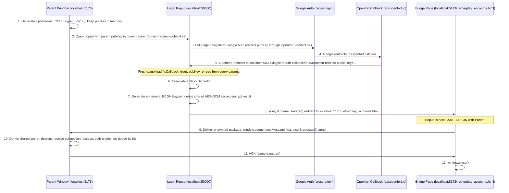

# Same-Origin Callback Bridge (Domain-Redirect Fallback)

## Overview

This document details the architecture and implementation plan for the **Same-Origin Callback Bridge** (also known as the Domain-Redirect Fallback). This mechanism provides a robust, future-proof, 100% client-side communication channel between the connection parent window and the login popup, even when browser security policies (like `Cross-Origin-Opener-Policy` or cross-scheme redirects) completely sever the `window.opener` relationship.

**Status**: Drafted — not yet implemented.

> **Note on existing scaffolding**: The codebase ALREADY contains partial scaffolding for this feature. This plan reconciles with and completes that scaffolding rather than inventing new conventions. Specifically:
> - `web/login/src/lib/state.ts:55` already reads the query param `domain-redirect-public-key` (kebab-case) into `domainRedirectPublicKey`.
> - `web/login/src/lib/Login.svelte:65-68` already has the branch `if (from.domainRedirectPublicKey) { window.location.href = \`${from.windowOrigin}/_etherplay_accounts.html#myencryptedresult\`; }` with a `// TODO encrypt`.
> - The redirect target file is therefore **`_etherplay_accounts.html`** and the param is **`domain-redirect-public-key`**. This plan uses those existing names. Do NOT introduce new names.

---

## The Problem: The Severed Opener

When the user initiates a popup-based OAuth login (e.g., via Google Auth):
1. The main app (parent) is hosted on one origin (e.g., `http://localhost:5173`).
2. The login popup is hosted on a different origin (e.g., `http://localhost:50000` — the `walletHost`).
3. During OAuth, the popup navigates to Google (`accounts.google.com`) and then Google redirects to the provider's callback (`api.openfort.io`), which finally redirects back to the popup origin (`http://localhost:50000/login/?oauth-callback=true...`).
4. **The Severance**: Due to the cross-origin boundary plus any enforced `Cross-Origin-Opener-Policy` (COOP) header on an intermediate page (e.g., `same-origin-allow-popups` on Openfort), the browser forces a **Browsing Context Group (BCG) swap**:
   - `window.opener` becomes `null` inside the popup.
   - `popup.closed` immediately becomes `true` in the parent window.
5. **The Result**: The popup is orphaned. It cannot use `postMessage` (opener is null) nor a same-origin `BroadcastChannel` (popup is on `:50000`, parent on `:5173` — different origins).

### Why other channels do not work

| Channel | Why it fails |
|---|---|
| `window.opener.postMessage` | `window.opener` is `null` after the BCG swap. |
| `BroadcastChannel` (from popup directly) | Sandboxed by origin; `:50000` channel ≠ `:5173` channel. |
| `localStorage` / `IndexedDB` | Partitioned by origin; not shared across `:50000` / `:5173`. |
| Cookies | Port-independent on `localhost` but NOT shared across different domains in production; not a general solution. |

The **only** general client-side solution is to make the popup re-enter the parent's origin via a redirect, then use `BroadcastChannel` (which is now same-origin).

---

## The Solution: Same-Origin Callback Bridge

If the `window.opener` link survives the whole OAuth chain, the popup just `postMessage`s the result back directly (no bridge needed). If the link was severed, the popup redirects **one final time** to a static file (`_etherplay_accounts.html`) served on the **parent's own origin**; running same-origin with the parent, that page delivers the (encrypted) result via `window.opener.postMessage` if available, otherwise via `BroadcastChannel`.

### Architectural Flow



### Important: opener severance is NON-DETERMINISTIC

Whether `window.opener` survives the OAuth redirect chain depends on COOP headers on Google / Openfort / any intermediate hop — which we do **not** control and which can change between provider deployments and browser versions.

Therefore we do **not** assume a fixed "phase" where the link breaks. Instead the design is **opportunistic**: every delivery point tries the direct `window.opener.postMessage` path first, and only falls back to the encrypted same-origin bridge when `window.opener` is null/closed.

A key empirical observation (from testing): when the popup finally **redirects back to the parent's own origin** (the bridge page `_etherplay_accounts.html`), `window.opener` frequently becomes **available again** (the BCG/opener relationship is re-established once same-origin). So the bridge page itself can often use `window.opener.postMessage` directly, with `BroadcastChannel` only as a fallback.

### The Critical Detail: Surviving the Full-Page OAuth Round-Trip

In the OAuth (`oauth-redirection`) flow, the popup performs **full-page navigations** (to Google, then Openfort, then back). Each navigation is a **fresh document load** — all in-memory JS state (the parent's public key, any keypair) is **destroyed**.

Therefore the parent's public key **must be carried through the entire redirect chain as a URL parameter**:

1. Parent appends `domain-redirect-public-key=<pubKeyB64>` to the popup launch URL.
2. On first popup load, `state.ts` reads `domain-redirect-public-key` into `domainRedirectPublicKey`.
3. When building Openfort's `redirectTo` URL (in `packages/etherplay-openfort/src/index.ts`, the `redirectUrl` string around line 191), the popup MUST append `&domain-redirect-public-key=<pubKeyB64>` so Openfort redirects back with it intact.
4. On the callback load (`oauth-callback=true`, `isCallback === true`), `state.ts` re-reads `domain-redirect-public-key` again from the (new) query params.
5. Only then, on `SignedIn`, does `Login.svelte` perform the encrypt-and-redirect to `_etherplay_accounts.html`.

> For non-OAuth flows (email OTP, mnemonic) there is no full-page navigation, so the key survives in memory; but for consistency the same query-param threading is used (it is already read on initial load).

---

## Security Design: Zero-Knowledge Native Encryption

The final redirect places sensitive credentials into a URL hash fragment. Although hash fragments are **not** sent to servers, they DO appear in the popup's `window.history` and could be read by anything with access to that document. Therefore the payload **must be encrypted**.

To do this **with zero third-party dependencies**, use the native browser **Web Crypto API** (`window.crypto.subtle`):
* **ECDH (Elliptic Curve Diffie-Hellman) on Curve P-256** for key agreement.
* **AES-GCM (256-bit)** for payload encryption.

ECDH + AES-GCM is chosen over RSA-OAEP because RSA-OAEP has a hard payload size limit (≈190 bytes for a 2048-bit key) that an Ethereum account/key payload would exceed. ECDH+AES-GCM has no such limit.

### Cryptographic Flow

1. **Parent**: generate an ECDH keypair (`extractable: true` so the public key can be exported). Keep the private key in memory in a scope reachable by the `BroadcastChannel` listener.
2. **Public key exchange**: export parent public key as JWK → JSON → base64 → query param `domain-redirect-public-key`.
3. **Popup (on `SignedIn`)**: generate its own ephemeral ECDH keypair, derive an AES-GCM-256 key from (parent pubKey + popup privKey), encrypt the payload with a fresh random 12-byte IV.
4. **Redirect package** (hash fragment): `data` (ciphertext b64), `iv` (b64), `pubKey` (popup ephemeral public JWK b64), `id` (requestID).
5. **Parent**: import popup ephemeral public key, derive the SAME AES-GCM key, decrypt.

### Payload size constraint

Keep the total redirect URL well under ~8000 chars (practical browser limit). The ciphertext of a typical account payload is small (a few hundred bytes b64). If a payload ever grows large, the design must switch to a server/`sessionStorage` relay — call this out at implementation time, do not silently exceed limits.

---

## Technical Specifications

### File / Param Conventions (FINAL — match existing code)

| Concern | Value |
|---|---|
| Bridge file name | `_etherplay_accounts.html` (already referenced in `Login.svelte:67`) |
| Public-key query param | `domain-redirect-public-key` (already read in `state.ts:55`) |
| BroadcastChannel name | `etherplay-connect` |
| Hash params from bridge | `data`, `iv`, `pubKey`, `id` |

### Delivery Strategy (opportunistic, not phase-based)

The popup/bridge tries the cheapest path that works and falls back:

1. **Direct opener path**: if `window.opener` is alive, just `window.opener.postMessage(...)`. This is the happy path when COOP did not sever the link. No bridge, no encryption needed — but for uniformity we still encrypt when a `domain-redirect-public-key` was provided.
2. **Same-origin bridge path**: if the opener is dead, redirect to `_etherplay_accounts.html` on the parent origin (encrypted payload in the hash). On that page, again try `window.opener.postMessage` first (it is often re-established once same-origin), then fall back to `BroadcastChannel`.

The bridge is **only relevant for the OAuth-redirection flow** (`oauth-redirection=true`), the only flow where the opener can be severed. The parent SDK generates and passes `domain-redirect-public-key` only for that flow (behind an opt-in config flag / provided public origin).

### Closed-popup UX (KEEP EXISTING BEHAVIOR — do not over-engineer)

`popup.closed === true` is **fundamentally ambiguous**: it is `true` both when the user genuinely closed the popup AND when the browser severed the opener while the popup is still alive on Google. There is **no reliable way** to disambiguate these.

Decision: **keep the existing UX exactly as-is.** When `popup.closed` becomes `true`, the parent surfaces the existing message *"Popup seems to be closed"* and lets the **user decide** to keep waiting or cancel (see `$connection.popupClosed` handling in the demo pages). This is honest and robust.

Do **NOT** add timeout-based auto-rejection, heartbeats, or opener-liveness phase detection. The user-driven keep-waiting/cancel choice already covers both the genuine-close and the severed-opener cases gracefully. If the bridge file is missing, the same UX applies — the user simply cancels.

### 1. The Bridge File (`_etherplay_accounts.html`)

Static HTML the integrator places in their app's public/static folder (served at `/_etherplay_accounts.html` on the parent origin).

```html
<!doctype html>
<html lang="en">
	<head>
		<meta charset="UTF-8" />
		<title>Completing Sign-In...</title>
		<script>
			(function () {
				var hashParams = new URLSearchParams(window.location.hash.slice(1));
				var data = hashParams.get('data');
				var iv = hashParams.get('iv');
				var pubKey = hashParams.get('pubKey');
				var id = hashParams.get('id');

				if (!(data && iv && pubKey && id)) {
					document.body.innerHTML = '<p>Error: missing redirect parameters. You can close this window.</p>';
					return;
				}

				var payload = {
					type: 'domain-redirect-result',
					encryptedResult: data,
					iv: iv,
					ephemeralPublicKey: pubKey,
					id: id,
				};

				// This page is SAME-ORIGIN with the parent. Two delivery paths are available;
				// try the direct opener first (often re-established once same-origin),
				// then fall back to BroadcastChannel. Parent accepts BOTH.
				var channel = new BroadcastChannel('etherplay-connect');

				// Close only after the parent acknowledges receipt (avoids dropping the message).
				channel.onmessage = function (event) {
					if (event && event.data && event.data.type === 'ack' && event.data.id === id) {
						try { channel.close(); } catch (e) {}
					window.close();
					}
				};

				// Path 1: direct opener (same-origin here, so '*' / our own origin is fine).
				try {
					if (window.opener && !window.opener.closed) {
						window.opener.postMessage(payload, window.origin);
					}
				} catch (e) {}

				// Path 2: BroadcastChannel (works even if opener is null).
				channel.postMessage(payload);

				// Safety fallback: close even if no ack arrives.
				setTimeout(function () {
					try { channel.close(); } catch (e) {}
					window.close();
				}, 3000);
			})();
		</script>
	</head>
	<body>
		<p>Completing sign-in, redirecting back to application...</p>
	</body>
</html>
```

### 2. Shared crypto helpers (zero-dependency, Web Crypto API)

Place in a shared util (e.g., `packages/etherplay-connect/src/crypto.ts`, re-used by the login app). Both sides need base64 helpers and key import/export.

```typescript
export const bufToB64 = (buf: ArrayBuffer | Uint8Array) =>
	btoa(String.fromCharCode(...new Uint8Array(buf as ArrayBuffer)));
export const b64ToBuf = (b64: string) => Uint8Array.from(atob(b64), (c) => c.charCodeAt(0));

export async function generateEcdhKeyPair(): Promise<CryptoKeyPair> {
	return window.crypto.subtle.generateKey(
		{name: 'ECDH', namedCurve: 'P-256'},
		true, // MUST be true so the public key is exportable
		['deriveKey'],
	);
}

export async function exportPublicKeyB64(key: CryptoKey): Promise<string> {
	const jwk = await window.crypto.subtle.exportKey('jwk', key);
	return btoa(JSON.stringify(jwk));
}

export async function importPublicKeyB64(b64: string): Promise<CryptoKey> {
	const jwk = JSON.parse(atob(b64));
	return window.crypto.subtle.importKey('jwk', jwk, {name: 'ECDH', namedCurve: 'P-256'}, true, []);
}

export async function deriveAesKey(privateKey: CryptoKey, otherPublicKey: CryptoKey, usage: KeyUsage[]) {
	return window.crypto.subtle.deriveKey(
		{name: 'ECDH', public: otherPublicKey},
		privateKey,
		{name: 'AES-GCM', length: 256},
		false,
		usage,
	);
}
```

### 3. Parent Window — generate key & thread it (in `index.ts`, NOT `popup.ts`)

The query params are assembled in `packages/etherplay-connect/src/index.ts` (around lines 1390–1455), so the key is generated and appended there, BEFORE calling `popupLauncher.launchPopup(...)`. The private key (or the full keypair) must be stored where the `BroadcastChannel` listener created in `popup.ts` can reach it — pass it into `launchPopup` as an option, or store it on a shared closure.

```typescript
// in index.ts, only for oauth-redirection flow + opt-in:
const parentKeyPair = await generateEcdhKeyPair();
const parentPubB64 = await exportPublicKeyB64(parentKeyPair.publicKey);
popupURL.searchParams.append('domain-redirect-public-key', parentPubB64);

// pass the keypair down so popup.ts can decrypt later
return popupLauncher.launchPopup(popupURL.toString(), {fullWindow, decryptKeyPair: parentKeyPair});
```

`popup.ts`'s `launchPopup` signature must be extended:

```typescript
function launchPopup(
	url: string,
	options?: {fullWindow?: boolean; decryptKeyPair?: CryptoKeyPair},
): ...
```

### 4. Parent Window — receive & decrypt (in `popup.ts`)

The encrypted `domain-redirect-result` can arrive via **two** transports, so handle it in a shared `handleEncryptedResult(d)` function called from BOTH:

1. the existing `window` `message` listener (`onMessage`), and
2. a new `BroadcastChannel('etherplay-connect')` listener.

**Origin acceptance**: the existing `onMessage` checks `messageEvent.origin === expectedOrigin` (the login/popup origin, e.g. `:50000`). The bridge page posts from the **parent's own origin** (e.g. `:5173`). So for `domain-redirect-result` messages, accept **both** `expectedOrigin` AND `window.origin`. (The encrypted payload + `id` match are the real authentication, so accepting both origins is safe.)

Note the **`==` (loose)** id comparison — `id` is a `number` here but arrives as a `string`.

```typescript
let handled = false; // de-dupe: the same result may arrive on both transports

async function handleEncryptedResult(d: any) {
	if (handled) return;
	if (!d || d.type !== 'domain-redirect-result') return;
	if (id != d.id) return; // loose compare: number == string
	if (!options?.decryptKeyPair) return;
	handled = true;
	try {
		const popupPub = await importPublicKeyB64(d.ephemeralPublicKey);
		const aesKey = await deriveAesKey(options.decryptKeyPair.privateKey, popupPub, ['decrypt']);
		const plain = await window.crypto.subtle.decrypt(
			{name: 'AES-GCM', iv: b64ToBuf(d.iv)},
			aesKey,
			b64ToBuf(d.encryptedResult),
		);
		const result = JSON.parse(new TextDecoder().decode(plain));
		// ACK so the bridge page can close itself cleanly (sent on both transports)
		channel?.postMessage({type: 'ack', id: d.id});
		try { (event as any)?.source?.postMessage({type: 'ack', id: d.id}, window.origin); } catch (e) {}
		resolveRecovery(result);
	} catch (err) {
		rejectRecovery({message: 'domain-redirect decryption failed', cause: err});
	}
}

// In the existing onMessage, accept the bridge message from our own origin too:
const onMessage = (messageEvent: MessageEvent) => {
	const d = messageEvent.data;
	if (d && d.type === 'domain-redirect-result') {
		if (messageEvent.origin === expectedOrigin || messageEvent.origin === window.origin) {
			handleEncryptedResult(d);
		}
		return;
	}
	// ... existing plain postMessage handling (result/error) for the non-bridge path ...
};

let channel: BroadcastChannel | undefined;
if (typeof BroadcastChannel !== 'undefined') {
	channel = new BroadcastChannel('etherplay-connect');
	channel.onmessage = (event) => handleEncryptedResult(event.data);
}
```

Cleanup: close `channel` in BOTH `resolveRecovery` and `rejectRecovery` (the existing functions).

#### Closed-popup handling: UNCHANGED

Do NOT add a timeout-based auto-reject for this flow. Keep `watchForPopupClosed` and the existing `popupClosed` UX exactly as they are: when `popup.closed` becomes `true`, surface *"Popup seems to be closed"* and let the user keep waiting or cancel. This intentionally covers both a genuine close and a (non-deterministic) severed opener — the user decides. The encrypted result, whichever transport delivers it, resolves the promise whenever it arrives.

### 5. Popup Window — deliver result (in `Login.svelte`)

Replace the existing `// TODO encrypt` block (lines 65–68). Delivery is **opportunistic**: try the direct opener first; only if the opener is dead AND a `domain-redirect-public-key` is present, fall back to the encrypted bridge redirect.

```typescript
} else if (v?.step === 'SignedIn') {
	if (!v.requireOriginApproval || !v.requireOriginApproval.requestingAccess) {
		const openerAlive = !!(from.source && !(from.source as Window).closed) ||
			!!(window.opener && !window.opener.closed);

		if (openerAlive) {
			// Happy path: link survived. Use the existing postMessage delivery.
			postResultIfNotAlreadyPosted(from.canCloseAutomatically);
		} else if (from.domainRedirectPublicKey) {
			// Opener severed: fall back to the encrypted same-origin bridge.
			const result = await deriveOriginAccount(from.signingOrigin, v.account, accountGenerator);
			await encryptAndRedirect(result, from.domainRedirectPublicKey, from.windowOrigin, from.requestID);
		} else {
			// No opener and no bridge configured: cannot communicate.
			// Keep existing behavior (will surface the closed-popup UX).
			postResultIfNotAlreadyPosted(from.canCloseAutomatically);
		}
	}
}
```

> Note: `from.source` (the opener `MessageEventSource`) is captured in `state.ts` from `window.opener`. After a severing OAuth round-trip it will be null on the fresh callback load; `window.opener` is re-checked directly as well. Because severance is non-deterministic, this check decides per-load which path to use.

```typescript
async function encryptAndRedirect(payload: any, parentPubB64: string, parentOrigin: string, requestId: string) {
	const parentPub = await importPublicKeyB64(parentPubB64);
	const ephemeral = await generateEcdhKeyPair();
	const aesKey = await deriveAesKey(ephemeral.privateKey, parentPub, ['encrypt']);

	const iv = window.crypto.getRandomValues(new Uint8Array(12));
	const ct = await window.crypto.subtle.encrypt(
		{name: 'AES-GCM', iv},
		aesKey,
		new TextEncoder().encode(JSON.stringify(payload)),
	);

	const dataB64 = bufToB64(ct);
	const ivB64 = bufToB64(iv);
	const ephPubB64 = await exportPublicKeyB64(ephemeral.publicKey);

	window.location.href =
		`${parentOrigin}/_etherplay_accounts.html` +
		`#data=${encodeURIComponent(dataB64)}` +
		`&iv=${encodeURIComponent(ivB64)}` +
		`&pubKey=${encodeURIComponent(ephPubB64)}` +
		`&id=${encodeURIComponent(requestId)}`;
}
```

> `from` is the `fromProps` object from `state.ts`; `domainRedirectPublicKey`, `windowOrigin`, `signingOrigin`, `requestID` are already present there.

### 6. Thread the key through the OAuth `redirectTo` (in `packages/etherplay-openfort/src/index.ts`)

Around line 191, where `redirectUrl` is built, append the public key so it survives the Google → Openfort → popup round-trip:

```typescript
const domainRedirectPublicKey = currentURL.searchParams.get('domain-redirect-public-key');
const drpkStr = domainRedirectPublicKey
	? `&domain-redirect-public-key=${encodeURIComponent(domainRedirectPublicKey)}`
	: '';

const redirectUrl =
	`${baseUrl}/login/?oauth-callback=true&oauth-redirection=true&type=oauth` +
	`&origin=${redirection.windowOrigin}&signingOrigin=${redirection.signingOrigin}` +
	`&id=${redirection.id}&oauth-provider=${authProviderId}` +
	`${auth0Connection ? `&oauth-connection=${auth0Connection}` : ''}` +
	`${accountTypeStr}${erudaStr}${debugStr}${logStr}${drpkStr}`;
```

---

## Implementation Checklist

1. [ ] Add `packages/etherplay-connect/src/crypto.ts` (Web Crypto helpers).
2. [ ] `index.ts`: behind an opt-in config flag, for the `oauth-redirection` flow, generate the ECDH keypair, append `domain-redirect-public-key`, and pass `decryptKeyPair` into `launchPopup`.
3. [ ] `popup.ts`: extend `launchPopup` options with `decryptKeyPair`; add a shared `handleEncryptedResult()` called from BOTH the `window` `message` listener (accepting `expectedOrigin` AND `window.origin`) and a new `BroadcastChannel('etherplay-connect')` listener; **loose `==`** id compare; de-dupe with a `handled` flag; decrypt; ACK on both transports; resolve. Close `channel` in `resolveRecovery`/`rejectRecovery`.
4. [ ] `popup.ts`: KEEP `watchForPopupClosed` and the existing `popupClosed` UX unchanged. Do NOT add timeout-based auto-reject.
5. [ ] `etherplay-openfort/src/index.ts`: append `domain-redirect-public-key` to the Openfort `redirectTo` URL so it survives the full-page round-trip.
6. [ ] `Login.svelte`: replace the `// TODO encrypt` block with the opportunistic delivery (try opener first via `postResultIfNotAlreadyPosted`, else `encryptAndRedirect(...)`).
7. [ ] Author/ship `_etherplay_accounts.html` (tries `window.opener.postMessage` first, then `BroadcastChannel`; ACK-aware close) and copy it into `web/static` (or equivalent) and the demo's static dir.
8. [ ] Verify `extractable: true` on parent keygen (export would throw otherwise).
9. [ ] Verify total redirect URL length stays well under ~8000 chars for real payloads.
10. [ ] Test: (a) link survives whole way → plain postMessage path works, accurate `popup.closed`; (b) opener severed → bridge path delivers encrypted result; (c) genuine user close → existing "Popup seems to be closed" keep-waiting/cancel UX; (d) decryption failure → clear reject.

---

## Developer Integration Steps

To adopt this bridge, integrators must:

1. Copy `_etherplay_accounts.html` into their framework's public/static folder so it is served at `/_etherplay_accounts.html` on the app's own origin:
   - **Vite**: `public/_etherplay_accounts.html`
   - **SvelteKit**: `static/_etherplay_accounts.html`
   - **Next.js**: `public/_etherplay_accounts.html`
2. Enable the opt-in config flag on the SDK so it activates the domain-redirect bridge for OAuth.

When enabled, the SDK natively encrypts the credential exchange (Web Crypto, no third-party libs) and completes sign-in reliably even when the opener relationship is severed.

---

## Known Trade-offs

- **Integration friction**: integrators must host one static file (`_etherplay_accounts.html`). This is unavoidable for a pure client-side solution. (Only needed for the OAuth bridge fallback.)
- **`popup.closed` is ambiguous when the opener is severed**: it can read `true` even though the popup is alive on Google. We deliberately do NOT try to auto-resolve this; the existing *"Popup seems to be closed — keep waiting or cancel"* UX is kept, leaving the decision to the user. When the link survives the whole way, `popup.closed` is accurate as before.
- **History entry**: the bridge URL (encrypted) lands in the popup's history before it closes. Encryption mitigates exposure; the popup closes immediately after ACK.
- **Severance is non-deterministic**: whether the bridge fallback is needed depends on COOP headers outside our control, so delivery is opportunistic (opener path first, encrypted bridge fallback) and the SDK never assumes which case it is in.
