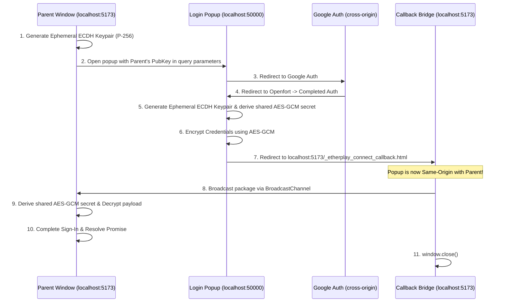

# Same-Origin Callback Bridge (Domain-Redirect Fallback)

## Overview

This document details the architecture and implementation plan for the **Same-Origin Callback Bridge** (also known as the Domain-Redirect Fallback). This mechanism provides a robust, future-proof, 100% client-side communication channel between the connection parent window and the login popup, even when browser security policies (like `Cross-Origin-Opener-Policy` or cross-scheme redirects) completely sever the `window.opener` relationship.

**Status**: Ready for Implementation (Drafted)

---

## The Problem: The Severed Opener

When the user initiates a popup-based OAuth login (e.g., via Google Auth):
1. The main app is hosted on one port/domain (e.g., `http://localhost:5173`).
2. The login popup is hosted on a different port/domain (e.g., `http://localhost:50000`).
3. During OAuth, the popup navigates to Google (`accounts.google.com`) and then redirects to the provider's callback (`api.openfort.io`).
4. **The Severance**: Due to the cross-origin boundary and any enforced `Cross-Origin-Opener-Policy` (COOP) headers (such as `same-origin-allow-popups` on Openfort):
   - The browser forces a **Browsing Context Group (BCG) swap**.
   - `window.opener` becomes `null` inside the popup.
   - `popup.closed` immediately becomes `true` in the parent window.
5. **The Result**: The parent window prematurely detects closure, and the popup is completely orphaned—unable to use `postMessage` or same-origin `BroadcastChannel` to send back the credentials.

---

## The Solution: Same-Origin Callback Bridge

By utilizing a temporary redirect back to a static file hosted on the **parent window's own origin**, we re-establish a same-origin execution sandbox within the popup. In this same-origin state, `BroadcastChannel` can be used to securely transmit the results.

### Architectural Flow



---

## Security Design: Zero-Knowledge Native Encryption

Because the final step involves passing sensitive authentication credentials (like session keys or private keys) back to the parent via URL redirects, **the payload must be encrypted** to prevent interception by local logs, proxy servers, or browser histories.

To achieve this **without adding third-party dependencies**, the SDK uses the native browser **Web Crypto API** (`window.crypto.subtle`) using:
* **ECDH (Elliptic Curve Diffie-Hellman) on Curve P-256** for key exchange/shared secret derivation.
* **AES-GCM (256-bit)** for encrypting the payload.

### The Cryptographic Flow

1. **Parent Generation**: The parent window generates an ephemeral ECDH keypair and holds the private key in memory.
2. **Public Key Exchange**: The parent's public key is exported as a JSON Web Key (JWK), base64-encoded, and passed to the popup in the query parameters (`&domainRedirectPublicKey=...`).
3. **Popup Encryption**:
   - The popup generates its own ephemeral ECDH keypair.
   - It derives the shared secret key (AES-GCM-256) using the parent's public key and its own private key.
   - It encrypts the payload using AES-GCM with a random 12-byte Initialization Vector (IV).
4. **Redirection Package**: The popup redirects back to the parent's origin, passing:
   - The encrypted payload (base64).
   - The popup's ephemeral public key (base64 JWK).
   - The random IV (base64).
5. **Parent Decryption**: The parent receives this package over the same-origin `BroadcastChannel`, imports the popup's public key, derives the same shared secret, and decrypts the payload.

---

## Technical Specifications

### 1. The Callback File (`_etherplay_connect_callback.html`)

This is a tiny, highly optimized static HTML file that developers place in their public/static directories (e.g., `static/` in SvelteKit or `public/` in Vite/Next.js).

```html
<!doctype html>
<html lang="en">
	<head>
		<meta charset="UTF-8" />
		<title>Completing Sign-In...</title>
		<script>
			(function () {
				// 1. Extract the encrypted data from the URL hash fragment
				const hashParams = new URLSearchParams(window.location.hash.slice(1));
				const data = hashParams.get('data');
				const iv = hashParams.get('iv');
				const pubKey = hashParams.get('pubKey');
				const id = hashParams.get('id');

				if (data && iv && pubKey && id) {
					// 2. Open the BroadcastChannel on our origin
					const channel = new BroadcastChannel('etherplay-connect');
					
					// 3. Broadcast the encrypted package back to the parent window
					channel.postMessage({
						encryptedResult: data,
						iv: iv,
						ephemeralPublicKey: pubKey,
						id: id
					});

					// 4. Delay closing to ensure transmission is fully queued
					setTimeout(() => {
						channel.close();
						window.close();
					}, 300);
				} else {
					document.body.innerHTML = "<p>Error: Missing redirect parameters. You can close this window.</p>";
				}
			})();
		</script>
	</head>
	<body>
		<p>Completing sign-in, redirecting back to application...</p>
	</body>
</html>
```

### 2. Implementation Code (Vite/Svelte/SDK)

Here is the exact, zero-dependency implementation of the cryptographic handshake using `window.crypto.subtle`:

#### A. Parent Window: Popup Initialization (`popup.ts`)

```typescript
// 1. Generate ephemeral ECDH keypair
const keyPair = await window.crypto.subtle.generateKey(
    { name: "ECDH", namedCurve: "P-256" },
    false,
    ["deriveKey"]
);

// 2. Export public key to base64 JWK
const exportedPublicKey = await window.crypto.subtle.exportKey("jwk", keyPair.publicKey);
const publicKeyB64 = btoa(JSON.stringify(exportedPublicKey));

// 3. Append to popup launch URL
urlObject.searchParams.append('domainRedirectPublicKey', publicKeyB64);
```

#### B. Popup Window: Encryption before redirect (`Login.svelte`)

```typescript
// Helper functions for base64 conversions
const arrayBufferToBase64 = (buffer: ArrayBuffer) => btoa(String.fromCharCode(...new Uint8Array(buffer)));
const base64ToArrayBuffer = (base64: string) => Uint8Array.from(atob(base64), c => c.charCodeAt(0));

async function encryptAndRedirect(resultPayload: any, parentPublicKeyB64: string, redirectUrl: string, requestId: string) {
    // 1. Import Parent's public key
    const parentPublicKeyJwk = JSON.parse(atob(parentPublicKeyB64));
    const parentPublicKey = await window.crypto.subtle.importKey(
        "jwk",
        parentPublicKeyJwk,
        { name: "ECDH", namedCurve: "P-256" },
        true,
        []
    );

    // 2. Generate Ephemeral ECDH keypair
    const ephemeralKeyPair = await window.crypto.subtle.generateKey(
        { name: "ECDH", namedCurve: "P-256" },
        true,
        ["deriveKey"]
    );

    // 3. Derive shared AES-GCM key
    const aesKey = await window.crypto.subtle.deriveKey(
        { name: "ECDH", public: parentPublicKey },
        ephemeralKeyPair.privateKey,
        { name: "AES-GCM", length: 256 },
        false,
        ["encrypt"]
    );

    // 4. Encrypt payload
    const iv = window.crypto.getRandomValues(new Uint8Array(12));
    const textEncoder = new TextEncoder();
    const encryptedBuffer = await window.crypto.subtle.encrypt(
        { name: "AES-GCM", iv: iv },
        aesKey,
        textEncoder.encode(JSON.stringify(resultPayload))
    );

    // 5. Export Ephemeral Public Key
    const exportedEphemeralPublicKey = await window.crypto.subtle.exportKey("jwk", ephemeralKeyPair.publicKey);

    // 6. Format the URL package
    const encDataB64 = arrayBufferToBase64(encryptedBuffer);
    const ivB64 = arrayBufferToBase64(iv);
    const epubKeyB64 = btoa(JSON.stringify(exportedEphemeralPublicKey));

    // 7. Perform the same-origin redirect
    window.location.href = `${redirectUrl}#data=${encDataB64}&iv=${ivB64}&pubKey=${epubKeyB64}&id=${requestId}`;
}
```

#### C. Parent Window: Decryption inside BroadcastChannel listener (`popup.ts`)

```typescript
channel.onmessage = async (event) => {
    const { encryptedResult, iv, ephemeralPublicKey, id: incomingId } = event.data;
    if (encryptedResult && incomingId === currentId) {
        try {
            // 1. Import Popup's ephemeral public key
            const popupPubKeyJwk = JSON.parse(atob(ephemeralPublicKey));
            const popupPublicKey = await window.crypto.subtle.importKey(
                "jwk",
                popupPubKeyJwk,
                { name: "ECDH", namedCurve: "P-256" },
                true,
                []
            );

            // 2. Derive same shared AES-GCM key
            const aesKey = await window.crypto.subtle.deriveKey(
                { name: "ECDH", public: popupPublicKey },
                keyPair.privateKey,
                { name: "AES-GCM", length: 256 },
                false,
                ["decrypt"]
            );

            // 3. Decrypt the payload
            const decryptedBuffer = await window.crypto.subtle.decrypt(
                { name: "AES-GCM", iv: base64ToArrayBuffer(iv) },
                aesKey,
                base64ToArrayBuffer(encryptedResult)
            );

            const decryptedText = new TextDecoder().decode(decryptedBuffer);
            const decryptedResult = JSON.parse(decryptedText);

            // 4. Resolve the SDK connection
            resolveRecovery(decryptedResult);
        } catch (err) {
            console.error("[etherplay-connect:parent] Decryption failed", err);
            rejectRecovery({ message: "Decryption failed", cause: err });
        }
    }
};
```

---

## Developer Integration Steps

To adopt this bridge in their apps, developers only need to perform one simple step:

Copy `_etherplay_connect_callback.html` from the `@etherplay/connect` package into their framework's static file folder:
* **Vite**: `public/_etherplay_connect_callback.html`
* **SvelteKit**: `static/_etherplay_connect_callback.html`
* **Next.js**: `public/_etherplay_connect_callback.html`

The SDK will automatically detect the presence of the file, encrypt the credential exchange natively using standard browser APIs, and complete the sign-in with 100% reliability.
