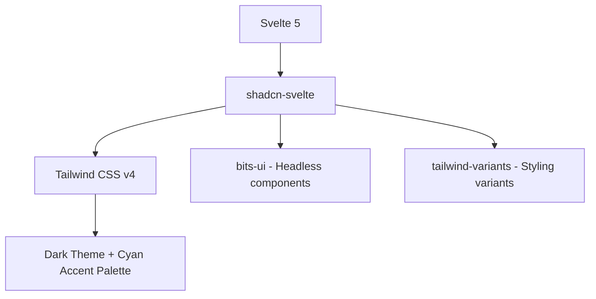
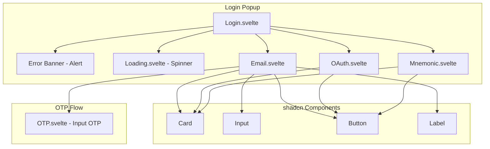

# Login Popup Redesign with shadcn-svelte

## Overview

Redesign the login popup UI using **shadcn-svelte** with a modern gaming aesthetic featuring:
- Dark theme with cyan/teal accents
- Sleek panels with subtle gradients and glows
- Smooth micro-animations
- Clean, minimal layout

## Current State

The login popup at [`web/login/`](web/login/) currently uses:
- Svelte 5 with runes (`$props`, `$state`, `$derived`)
- Custom CSS with dark mode via `prefers-color-scheme`
- Basic input styling and purple accent color (`#524ed2`)

### Key Files to Modify
| File | Purpose |
|------|---------|
| [`web/login/src/app.css`](web/login/src/app.css:1) | Global styles |
| [`web/login/src/lib/Login.svelte`](web/login/src/lib/Login.svelte:1) | Main container |
| [`web/login/src/lib/mechanism/Email.svelte`](web/login/src/lib/mechanism/Email.svelte:1) | Email login flow |
| [`web/login/src/lib/mechanism/OAuth.svelte`](web/login/src/lib/mechanism/OAuth.svelte:1) | OAuth providers |
| [`web/login/src/lib/mechanism/Mnemonic.svelte`](web/login/src/lib/mechanism/Mnemonic.svelte:1) | Mnemonic account picker |
| [`web/login/src/lib/mechanism/components/OTP.svelte`](web/login/src/lib/mechanism/components/OTP.svelte:1) | OTP input |
| [`web/login/src/lib/Loading.svelte`](web/login/src/lib/Loading.svelte:1) | Loading state |

---

## Architecture

### Tech Stack Addition



### Component Structure



---

## Design System

### Color Palette

| Token | Value | Usage |
|-------|-------|-------|
| `--background` | `#0a0f14` | Main background - deep dark |
| `--card` | `#111820` | Card background - slightly lighter |
| `--card-foreground` | `#e5e7eb` | Card text |
| `--primary` | `#06b6d4` | Cyan accent - buttons, focus |
| `--primary-foreground` | `#0a0f14` | Text on primary |
| `--secondary` | `#164e63` | Secondary cyan - hover states |
| `--muted` | `#1e293b` | Muted backgrounds |
| `--muted-foreground` | `#94a3b8` | Placeholder text |
| `--border` | `#1e3a4a` | Subtle border with cyan tint |
| `--ring` | `#06b6d4` | Focus ring |
| `--destructive` | `#ef4444` | Error/deny button |

### Gaming UI Elements

1. **Glow Effects**
   ```css
   .gaming-glow {
     box-shadow: 0 0 20px rgba(6, 182, 212, 0.3);
   }
   ```

2. **Subtle Gradient Borders**
   ```css
   .gaming-border {
     border: 1px solid transparent;
     background: linear-gradient(var(--card), var(--card)) padding-box,
                 linear-gradient(135deg, var(--primary), transparent) border-box;
   }
   ```

3. **Smooth Animations**
   - Button hover: scale + glow pulse
   - Input focus: border glow transition
   - Loading: spinning + pulsing icon
   - OTP boxes: fill animation

---

## Implementation Steps

### 1. Setup Dependencies

Install required packages in `web/package.json`:

```bash
cd web && pnpm add -D tailwindcss@next @tailwindcss/vite bits-ui@next tailwind-variants clsx tailwind-merge
```

Initialize Tailwind CSS v4:
```bash
npx tailwindcss init
```

### 2. Configure Tailwind

Create `web/login/src/app.css` with Tailwind imports and custom gaming theme:

```css
@import "tailwindcss";

@theme {
  --color-background: #0a0f14;
  --color-card: #111820;
  --color-primary: #06b6d4;
  --color-secondary: #164e63;
  /* ... more tokens */
}
```

### 3. Add shadcn-svelte Components

Components needed:
- **Button** - Login, Continue, Accept, Deny actions
- **Input** - Email input field
- **Card** - Container for login forms
- **Label** - Form labels
- **Alert** - Error banner
- **Input OTP** - 6-digit code input

Create at: `web/login/src/lib/components/ui/`

### 4. Redesign Email Login Flow

**Before:**
- Basic `<form>` with plain input and button
- Custom CSS styling

**After:**
```svelte
<Card class="gaming-card">
  <CardHeader>
    <CardTitle>Sign in via Email</CardTitle>
  </CardHeader>
  <CardContent>
    <Label for="email">Email</Label>
    <Input 
      id="email" 
      type="email" 
      placeholder="conan@catacombs.world"
      class="gaming-input"
    />
    <Button class="gaming-button w-full">Login</Button>
  </CardContent>
</Card>
```

### 5. Redesign OTP Component

Transform the 6-box OTP input to use shadcn Input OTP:

```svelte
<InputOTP maxlength={6} bind:value={otp}>
  <InputOTPGroup>
    {#each Array.from({ length: 6 }) as _, i}
      <InputOTPSlot index={i} class="gaming-otp-slot" />
    {/each}
  </InputOTPGroup>
</InputOTP>
```

### 6. Add Gaming Animations

```css
@keyframes gaming-pulse {
  0%, 100% { box-shadow: 0 0 5px var(--primary); }
  50% { box-shadow: 0 0 20px var(--primary); }
}

@keyframes gaming-spin {
  from { transform: rotate(0deg); }
  to { transform: rotate(360deg); }
}

.gaming-button:hover {
  animation: gaming-pulse 1.5s ease-in-out infinite;
  transform: scale(1.02);
}
```

---

## Visual Mockup Concept

```
┌──────────────────────────────────────────┐
│           [  MAIL ICON  ]                │
│           (cyan glow)                    │
│                                          │
│    ╔════════════════════════════════╗    │
│    ║  Sign in via Email             ║    │
│    ╠════════════════════════════════╣    │
│    ║  ┌──────────────────────────┐  ║    │
│    ║  │ conan@catacombs.world    │  ║    │
│    ║  └──────────────────────────┘  ║    │
│    ║                                ║    │
│    ║  ┌──────────────────────────┐  ║    │
│    ║  │       L O G I N         │  ║    │
│    ║  └──────────────────────────┘  ║    │
│    ╚════════════════════════════════╝    │
│    (card with subtle gradient border)    │
└──────────────────────────────────────────┘
```

OTP Screen:
```
┌──────────────────────────────────────────┐
│           [  MAIL ICON  ]                │
│                                          │
│    Check your email for the code         │
│                                          │
│    ┌───┐ ┌───┐ ┌───┐ ┌───┐ ┌───┐ ┌───┐  │
│    │ _ │ │ _ │ │ _ │ │ _ │ │ _ │ │ _ │  │
│    └───┘ └───┘ └───┘ └───┘ └───┘ └───┘  │
│    (OTP inputs with cyan focus glow)     │
│                                          │
└──────────────────────────────────────────┘
```

---

## File Changes Summary

| File | Action | Description |
|------|--------|-------------|
| `web/package.json` | MODIFY | Add Tailwind, bits-ui, tailwind-variants |
| `web/vite.config.js` | MODIFY | Add Tailwind plugin |
| `web/login/src/app.css` | REPLACE | Tailwind base + gaming theme |
| `web/login/src/lib/components/ui/` | CREATE | shadcn components folder |
| `web/login/src/lib/utils.ts` | MODIFY | Add cn utility function |
| `web/login/src/lib/Login.svelte` | MODIFY | Use Card, Alert components |
| `web/login/src/lib/mechanism/Email.svelte` | MODIFY | Redesign with shadcn |
| `web/login/src/lib/mechanism/OAuth.svelte` | MODIFY | Redesign with shadcn |
| `web/login/src/lib/mechanism/Mnemonic.svelte` | MODIFY | Redesign with shadcn |
| `web/login/src/lib/mechanism/components/OTP.svelte` | MODIFY | Use InputOTP |
| `web/login/src/lib/Loading.svelte` | MODIFY | Gaming-themed spinner |

---

## Design Decisions (Confirmed)

✅ **Icons**: Custom gaming-style icons with glow effects
✅ **Fonts**: Gaming fonts - "Orbitron" for headings, "Rajdhani" for body text
✅ **Animations**: Full animations including:
   - OTP box fill/typing animations with glow on completion
   - Button hover glow pulse effect
   - Loading spinner with gaming flair (rotating + pulsing)
   - Icon glow animations
   - Smooth state transitions between login steps

### Font Setup

```css
@import url('https://fonts.googleapis.com/css2?family=Orbitron:wght@400;500;600;700&family=Rajdhani:wght@400;500;600;700&display=swap');

:root {
  --font-heading: 'Orbitron', sans-serif;
  --font-body: 'Rajdhani', sans-serif;
}
```

### Custom Gaming Icons

For the email icon, we'll create a stylized envelope with:
- Rounded corners with gradient stroke
- Subtle inner glow
- Pulsing animation during loading states

```svelte
<svg class="gaming-icon" viewBox="0 0 24 24">
  <!-- Custom gaming mail icon with glow filter -->
  <defs>
    <filter id="glow">
      <feGaussianBlur stdDeviation="2" result="coloredBlur"/>
      <feMerge>
        <feMergeNode in="coloredBlur"/>
        <feMergeNode in="SourceGraphic"/>
      </feMerge>
    </filter>
  </defs>
  <!-- Icon paths with filter="url(#glow)" -->
</svg>
```

---

## Next Steps

Once this plan is approved:
1. Switch to **Code mode** to implement the changes
2. Start with dependency setup and Tailwind configuration
3. Create shadcn-svelte components
4. Update each mechanism file iteratively
5. Test visually in browser
