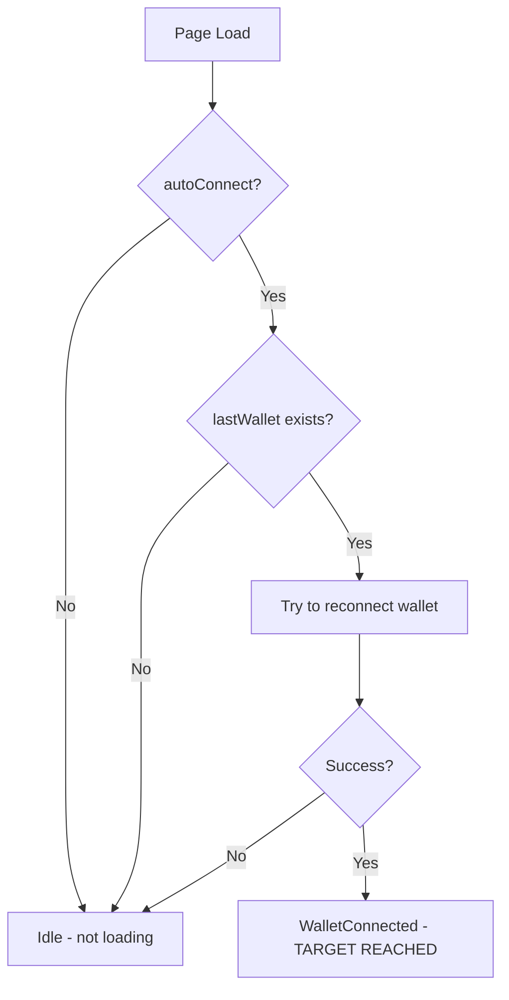
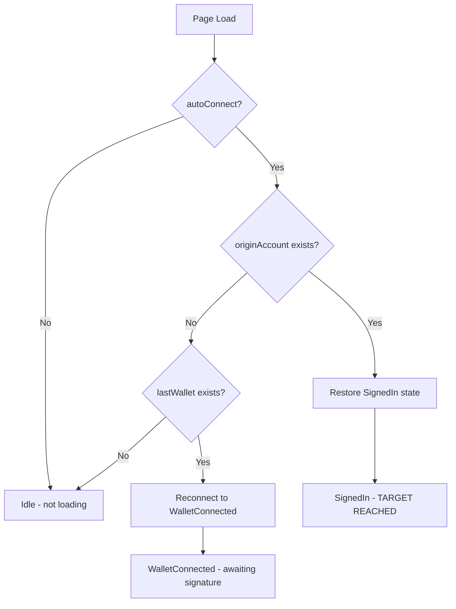

# Target Step Feature Design

## Overview

This document outlines the design for adding a configurable `targetStep` option to `@etherplay/connect` that allows applications to specify whether they need full authentication (`SignedIn`) or just wallet connection (`WalletConnected`).

## Files to Modify

- **Main implementation**: `packages/etherplay-connect/src/index.ts`
  - `createConnection` function overloads: ~lines 243-280
  - Auto-connect logic: ~lines 295-473
  - `ensureConnected` implementation: ~lines 1040-1097
- **Demo page**: `demoes/sveltekit/src/routes/web3-wallet/+page.svelte`

## Goals

1. Allow apps to declare their target connection step in config
2. Provide strong TypeScript typing - `ensureConnected()` returns the correct type based on configured target
3. Make `isTargetReached` available on the connection state
4. Auto-connect behavior respects the target step
5. Backwards compatible - default target is `SignedIn`

## Type Design

### Target Step Type

```typescript
type TargetStep = 'WalletConnected' | 'SignedIn';
```

### Generic ConnectionStore

The `ConnectionStore` type needs to become generic over both `WalletProviderType` and `TargetStep`:

```typescript
export type ConnectionStore<
  WalletProviderType,
  Target extends TargetStep = 'SignedIn'
> = {
  subscribe: (run: (value: Connection<WalletProviderType>) => void) => () => void;
  connect: (
    mechanism?: Target extends 'WalletConnected' 
      ? WalletMechanism<string | undefined, `0x${string}` | undefined> 
      : Mechanism,
    options?: ConnectionOptions,
  ) => Promise<void>;
  cancel: () => void;
  back: (step: 'MechanismToChoose' | 'Idle' | 'WalletToChoose') => void;
  requestSignature: () => Promise<void>;
  connectToAddress: (
    address: `0x${string}`,
    options?: {requireUserConfirmationBeforeSignatureRequest: boolean},
  ) => void;
  disconnect: () => void;
  getSignatureForPublicKeyPublication: () => Promise<`0x${string}`>;
  switchWalletChain: (chainInfo?: BasicChainInfo) => Promise<void>;
  unlock: () => Promise<void>;
  
  // Updated ensureConnected signature
  ensureConnected: Target extends 'WalletConnected'
    ? {
        (options?: ConnectionOptions): Promise<WalletConnected<WalletProviderType>>;
        (
          step: 'WalletConnected',
          mechanism?: WalletMechanism<string | undefined, `0x${string}` | undefined>,
          options?: ConnectionOptions,
        ): Promise<WalletConnected<WalletProviderType>>;
      }
    : {
        (options?: ConnectionOptions): Promise<SignedIn<WalletProviderType>>;
        (
          step: 'WalletConnected',
          mechanism?: WalletMechanism<string | undefined, `0x${string}` | undefined>,
          options?: ConnectionOptions,
        ): Promise<WalletConnected<WalletProviderType>>;
        (
          step: 'SignedIn',
          mechanism?: Mechanism,
          options?: ConnectionOptions,
        ): Promise<SignedIn<WalletProviderType>>;
      };

  // New properties
  targetStep: Target;
  isTargetReached: boolean;
  
  // Existing properties
  provider: WalletProviderType;
  chainId: string;
  chainInfo: ChainInfo<WalletProviderType>;
};
```

### createConnection Function Overloads

The key insight is that `walletHost` is only required for popup-based authentication (email, OAuth, mnemonic). When `targetStep: 'WalletConnected'`, we only use web3 wallets, so `walletHost` becomes optional.

```typescript
// WalletConnected target with custom wallet connector - walletHost optional
export function createConnection<WalletProviderType>(settings: {
  targetStep: 'WalletConnected';
  walletHost?: string; // Optional! Only needed for popup auth
  chainInfo: ChainInfo<WalletProviderType>;
  walletConnector: WalletConnector<WalletProviderType>;
  autoConnect?: boolean; // Auto-reconnect to lastWallet
  alwaysUseCurrentAccount?: boolean;
  prioritizeWalletProvider?: boolean;
  requestsPerSecond?: number;
}): ConnectionStore<WalletProviderType, 'WalletConnected'>;

// WalletConnected target with default Ethereum connector - walletHost optional
export function createConnection(settings: {
  targetStep: 'WalletConnected';
  walletHost?: string; // Optional! Only needed for popup auth
  chainInfo: ChainInfo<UnderlyingEthereumProvider>;
  walletConnector?: undefined;
  autoConnect?: boolean; // Auto-reconnect to lastWallet
  alwaysUseCurrentAccount?: boolean;
  prioritizeWalletProvider?: boolean;
  requestsPerSecond?: number;
}): ConnectionStore<UnderlyingEthereumProvider, 'WalletConnected'>;

// SignedIn target (explicit) with custom wallet connector - walletHost required
export function createConnection<WalletProviderType>(settings: {
  targetStep?: 'SignedIn';
  walletHost: string; // Required for popup-based auth
  chainInfo: ChainInfo<WalletProviderType>;
  walletConnector: WalletConnector<WalletProviderType>;
  signingOrigin?: string;
  autoConnect?: boolean; // Auto-restore originAccount OR fallback to lastWallet
  requestSignatureAutomaticallyIfPossible?: boolean;
  alwaysUseCurrentAccount?: boolean;
  prioritizeWalletProvider?: boolean;
  requestsPerSecond?: number;
}): ConnectionStore<WalletProviderType, 'SignedIn'>;

// SignedIn target (default) with default Ethereum connector - walletHost required
export function createConnection(settings: {
  targetStep?: 'SignedIn';
  walletHost: string; // Required for popup-based auth
  chainInfo: ChainInfo<UnderlyingEthereumProvider>;
  walletConnector?: undefined;
  signingOrigin?: string;
  autoConnect?: boolean; // Auto-restore originAccount OR fallback to lastWallet
  requestSignatureAutomaticallyIfPossible?: boolean;
  alwaysUseCurrentAccount?: boolean;
  prioritizeWalletProvider?: boolean;
  requestsPerSecond?: number;
}): ConnectionStore<UnderlyingEthereumProvider, 'SignedIn'>;
```

**Note:** The settings types enforce target-specific options:
- `signingOrigin`, `requestSignatureAutomaticallyIfPossible` - **only allowed for `SignedIn` target** (not present in `WalletConnected` settings type)
- TypeScript will enforce this at compile time - attempting to use these options with `targetStep: 'WalletConnected'` will be a type error

## Behavioral Changes

### Auto-Connect Logic

With the `targetStep` feature, the `autoConnectWallet` option is removed. The `autoConnect` option now has behavior that depends on the configured `targetStep`:

**When `targetStep: 'WalletConnected'`:**



- Only checks `lastWallet` in localStorage (never checks `originAccount`)
- Target is reached when `WalletConnected` state is achieved

**When `targetStep: 'SignedIn'` (default):**



- First checks `originAccount` to restore full `SignedIn` state
- Falls back to `lastWallet` to restore `WalletConnected` state (user can then sign to complete)
- This is the same as the old `autoConnect: true, autoConnectWallet: true` behavior

**Simplification Benefits:**
- Removes the confusing `autoConnectWallet` option that was only evaluated conditionally
- Single `autoConnect` boolean with behavior determined by `targetStep`
- No more ambiguous states like `autoConnect: false, autoConnectWallet: true`

### Key Behavior Differences for WalletConnected Target

1. **Does NOT save originAccount to localStorage** - only saves lastWallet
2. **Does NOT auto-request signatures** - `requestSignatureAutomaticallyIfPossible` is ignored
3. **connect() with wallet mechanism stops at WalletConnected** - doesn't proceed to request signature
4. **isTargetReached** is true when step is `WalletConnected` OR `SignedIn`

### isTargetReached Computation

```typescript
function computeIsTargetReached(
  currentStep: Connection['step'],
  target: TargetStep
): boolean {
  if (currentStep === 'SignedIn') return true; // Always target reached for both
  if (target === 'WalletConnected' && currentStep === 'WalletConnected') return true;
  return false;
}
```

## API Usage Examples

### Wallet-Only App (WalletConnected target)

```typescript
// Note: walletHost is optional for WalletConnected target!
const connection = createConnection({
  targetStep: 'WalletConnected',
  chainInfo,
  autoConnect: true,
  // walletHost not needed - no popup-based auth
});

// Type-safe: connection.ensureConnected() returns Promise<WalletConnected>
const state = await connection.ensureConnected();
// state.mechanism.address is available
// state.wallet is available

// Can still manually request signature if needed
if (needsSignature) {
  await connection.requestSignature();
}

// Check if target is reached
if (connection.isTargetReached) {
  // Ready to send transactions
}
```

### Full Auth App (SignedIn target - default)

```typescript
const connection = createConnection({
  // targetStep: 'SignedIn' is default
  walletHost: PUBLIC_WALLET_HOST,
  chainInfo,
  autoConnect: true,
  requestSignatureAutomaticallyIfPossible: true,
});

// Type-safe: connection.ensureConnected() returns Promise<SignedIn>
const state = await connection.ensureConnected();
// state.account is available with signer info

// Can still request just wallet connection
const walletState = await connection.ensureConnected('WalletConnected');
```

## Migration Path

### Backwards Compatibility

- Default `targetStep` is `'SignedIn'` - existing code works unchanged
- All existing methods remain available
- Type inference works for existing code
- **`autoConnectWallet` option is removed** - the `autoConnect` option with `targetStep: 'SignedIn'` (default) now always does what `autoConnect: true, autoConnectWallet: true` did before (fallback to last wallet when no saved account)

### Migration for Apps Using autoConnectWallet

**Before:**
```typescript
const connection = createConnection({
  walletHost: PUBLIC_WALLET_HOST,
  chainInfo,
  autoConnect: true,
  autoConnectWallet: false, // Don't auto-reconnect to wallet if no account
});
```

**After:**
The same behavior is achieved by default with `targetStep: 'SignedIn'` - no change needed unless you specifically want to disable the lastWallet fallback. In that case, you may need to handle this in application code by checking the restored state.

### Migration for Wallet-Only Apps

**Before:**
```typescript
const connection = createConnection({
  walletHost: PUBLIC_WALLET_HOST,
  chainInfo,
  requestSignatureAutomaticallyIfPossible: false,
});

// Manual check and workaround
connection.ensureConnected('WalletConnected', { type: 'wallet' });
```

**After:**
```typescript
const connection = createConnection({
  targetStep: 'WalletConnected',
  chainInfo,
  // walletHost not needed anymore!
});

// Clean API with proper types
connection.ensureConnected(); // Returns WalletConnected type
```

## Implementation Tasks

1. Add `TargetStep` type definition
2. Update `ConnectionStore` type to be generic over `TargetStep`
3. Add function overloads to `createConnection` for different target steps
4. Add `targetStep` and `isTargetReached` properties to the returned store
5. **Remove `autoConnectWallet` option** - simplify auto-connect logic based on `targetStep`:
   - When `targetStep: 'WalletConnected'`: only check `lastWallet`
   - When `targetStep: 'SignedIn'`: check `originAccount` first, then fallback to `lastWallet`
6. Modify `connect()` function to not auto-request signature when `targetStep: 'WalletConnected'`
7. Update `ensureConnected()` implementation to use configured target as default
8. Export new types for consumers
9. Update demo page `demoes/sveltekit/src/routes/web3-wallet/+page.svelte` to use the new API
10. Add tests for new behavior

## Design Decisions

1. **Storage keys**: Use the same storage keys (`__origin_account`, `__last_wallet`), but `WalletConnected` apps only read/write `lastWallet`, not `originAccount`.

2. **Existing saved SignedIn state**: If an app uses `targetStep: 'WalletConnected'` and there's a saved `originAccount`, the app will only see `WalletConnected` state. The `requestSignature()` method is still available if the app wants to upgrade to `SignedIn`.

3. **connect() mechanism restriction**: When `targetStep: 'WalletConnected'`, `connect()` only accepts `WalletMechanism` types. TypeScript will enforce this through the generic parameter on the `connect` method signature.
