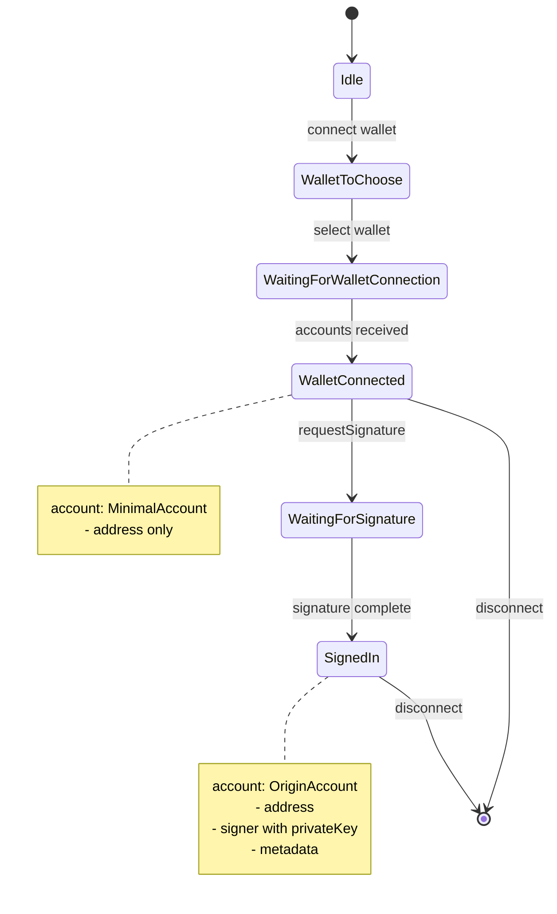

# Unified Account Address API Design

## Problem Statement

Currently, users of `@etherplay/connect` need to use conditional logic to access the wallet address generically:

```typescript
$connection.step === 'SignedIn'
  ? $connection.account.address
  : $connection.mechanism.address
```

This is required to support both `targetStep == 'WalletConnected'` and `targetStep == 'SignedIn'` configurations.

## Solution: Add Minimal Account Type to WalletConnected

Add an `account` field to `WalletConnected` containing at minimum the `address` field. This allows users to simply use:

```typescript
$connection.account.address  // Works for both WalletConnected and SignedIn
```

## Type Design

### New Types

```typescript
// Minimal account info - just the address
export type MinimalAccount = {
  address: `0x${string}`;
};

// Full OriginAccount remains unchanged (from @etherplay/alchemy)
export type OriginAccount = {
  address: `0x${string}`;
  signer: {
    origin: string;
    address: `0x${string}`;
    publicKey: `0x${string}`;
    privateKey: `0x${string}`;
    mnemonicKey: `0x${string}`;
  };
  metadata: {
    email?: string;
  };
  mechanismUsed: AlchemyMechanism | { type: string };
  savedPublicKeyPublicationSignature?: `0x${string}`;
  accountType: string;
};
```

### Updated WalletConnected Type

**Before:**
```typescript
type WalletConnected<WalletProviderType> = {
  step: 'WalletConnected';
  mechanism: WalletMechanism<string, `0x${string}`>;
  wallet: WalletState<WalletProviderType>;
};
```

**After:**
```typescript
type WalletConnected<WalletProviderType> = {
  step: 'WalletConnected';
  mechanism: WalletMechanism<string, `0x${string}`>;
  wallet: WalletState<WalletProviderType>;
  account: MinimalAccount;  // NEW FIELD
};
```

### SignedIn Type (Unchanged Structure)

```typescript
type SignedIn<WalletProviderType> =
  | {
      step: 'SignedIn';
      mechanism: AlchemyMechanism;
      account: OriginAccount;  // Already has full account
      wallet: undefined;
    }
  | {
      step: 'SignedIn';
      mechanism: WalletMechanism<string, `0x${string}`>;
      account: OriginAccount;  // Already has full account
      wallet: WalletState<WalletProviderType>;
    };
```

## Implementation Changes

### 1. Type Definitions (packages/etherplay-connect/src/index.ts)

**Lines 88-92:** Update `WalletConnected` type to include `account`:

```typescript
type WalletConnected<WalletProviderType> = {
  step: 'WalletConnected';
  mechanism: WalletMechanism<string, `0x${string}`>;
  wallet: WalletState<WalletProviderType>;
  account: { address: `0x${string}` };  // ADD THIS
};
```

**Lines 82-86:** Update `WaitingForSignature` to also include account for consistency:

```typescript
type WaitingForSignature<WalletProviderType> = {
  step: 'WaitingForSignature';
  mechanism: WalletMechanism<string, `0x${string}`>;
  wallet: WalletState<WalletProviderType>;
  account: { address: `0x${string}` };  // ADD THIS
};
```

### 2. State Transitions - Setting Account Field

Update all places where we set state to `WalletConnected` to include the `account` field.

**Location 1: Line ~589-601 (auto-connect lastWallet)**
```typescript
set({
  step: 'WalletConnected',
  mechanism: lastWallet,
  wallets: $connection.wallets,
  wallet: { ... },
  account: { address: lastWallet.address },  // ADD
});
```

**Location 2: Line ~978-1011 (connect with requestAccounts)**
```typescript
const newState: Connection<WalletProviderType> =
  nextStep === 'ChooseWalletAccount'
    ? { ... }
    : {
        step: nextStep,
        mechanism: { ...mechanismToSave, address: account },
        wallets: $connection.wallets,
        wallet: { ... },
        account: { address: account },  // ADD
      };
```

**Location 3: Line ~1054-1086 (connect with existing accounts)**
```typescript
const newState: Connection<WalletProviderType> =
  nextStep === 'ChooseWalletAccount'
    ? { ... }
    : {
        step: nextStep,
        mechanism: { ...mechanismToSave, address: account },
        wallets: $connection.wallets,
        wallet: { ... },
        account: { address: account },  // ADD
      };
```

**Location 4: Line ~718-728 (requestSignature error fallback to WalletConnected)**
```typescript
set({
  ...$connection,
  step: 'WalletConnected',
  mechanism: {
    type: 'wallet',
    name: $connection.mechanism.name,
    address: $connection.mechanism.address,
  },
  account: { address: $connection.mechanism.address },  // ADD
  error: { message: 'failed to sign message', cause: err },
});
```

**Location 5: Lines ~703-706 (set WaitingForSignature)**
```typescript
set({
  ...$connection,
  step: 'WaitingForSignature',
  account: { address: $connection.mechanism.address },  // ADD
});
```

### 3. Demo Updates

**demoes/sveltekit/src/routes/web3-wallet/+page.svelte**

Update line 33 and line 20-21:
```diff
- you are signed-in: {$connection.mechanism.address}
+ you are signed-in: {$connection.account.address}

- { from: $connection.mechanism.address, to: $connection.mechanism.address, value: '0x0' }
+ { from: $connection.account.address, to: $connection.account.address, value: '0x0' }
```

**demoes/sveltekit/src/routes/web3-wallet-signed-in/+page.svelte**

Lines already use `$connection.account.address` - no change needed.

## User Experience After Change

```typescript
// Before (required conditional)
const address = $connection.step === 'SignedIn'
  ? $connection.account.address
  : $connection.mechanism.address;

// After (unified access)
const address = $connection.account.address;

// Type narrowing still works for signer access
if ($connection.step === 'SignedIn') {
  const signerPublicKey = $connection.account.signer.publicKey;
}

// Or using the type guard
if (connection.isTargetStepReached($connection)) {
  // For targetStep: 'SignedIn', signer is available
  const signerPublicKey = $connection.account.signer.publicKey;
}
```

## Backward Compatibility

- **`mechanism.address`** remains available and unchanged
- Existing code using `mechanism.address` will continue to work
- New code can use `account.address` for cleaner API

## Type Safety Considerations

When accessing `account.signer`, TypeScript will require narrowing:

```typescript
// ERROR: Property 'signer' does not exist on type '{ address: `0x${string}` }'
const signer = $connection.account.signer;

// OK: After type narrowing
if ($connection.step === 'SignedIn') {
  const signer = $connection.account.signer;  // TypeScript knows it's OriginAccount
}
```

## Flow Diagram



## Summary of Changes

| File | Change |
|------|--------|
| `packages/etherplay-connect/src/index.ts` | Add `account` field to `WalletConnected` and `WaitingForSignature` types |
| `packages/etherplay-connect/src/index.ts` | Update all state transitions to `WalletConnected` to include `account` |
| `demoes/sveltekit/src/routes/web3-wallet/+page.svelte` | Update to use `account.address` instead of `mechanism.address` |

## Implementation Checklist

- [ ] Define `MinimalAccount` type (or inline `{ address: \`0x${string}\` }`)
- [ ] Update `WalletConnected` type definition
- [ ] Update `WaitingForSignature` type definition  
- [ ] Update auto-connect lastWallet state transition
- [ ] Update connect() requestAccounts state transitions
- [ ] Update requestSignature() error fallback state
- [ ] Update WaitingForSignature state transition
- [ ] Update web3-wallet demo to use new API
- [ ] Test both targetStep configurations
- [ ] Update any documentation/README
